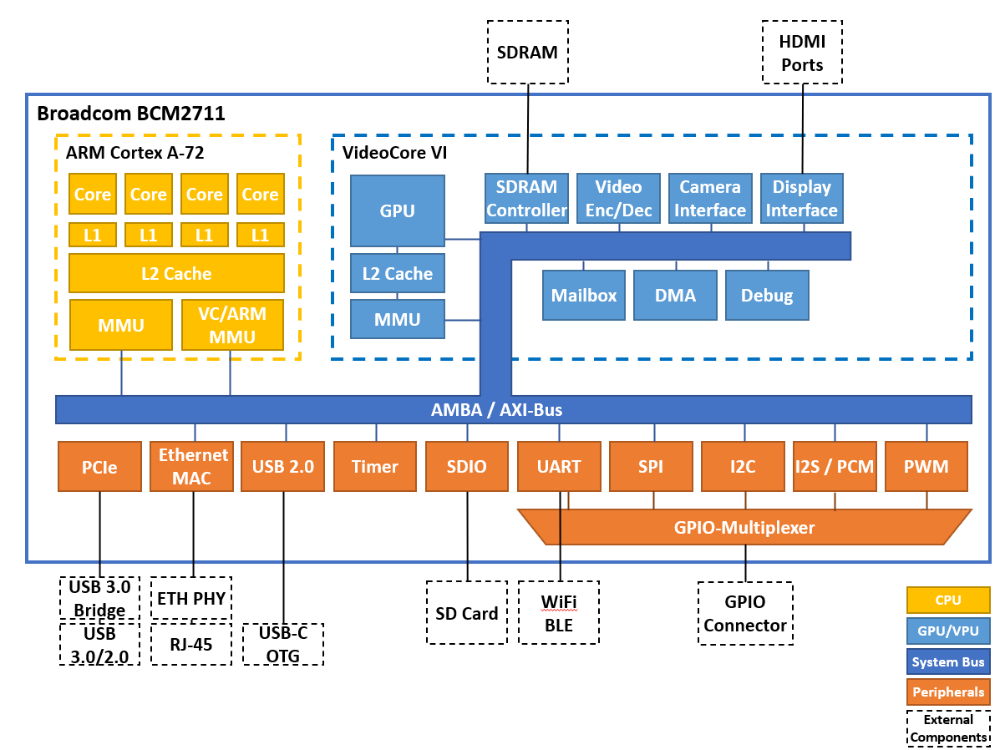

========================
Embedded System Hardware
========================
This chapter introduces the computing hardware which is used in all experiments. Although the specific details of the following description relate to the Raspberry Pi platform, the fundamental aspects of interaction between software, system hardware and external devices are platform independent. The first section describes the Raspberry Pi hardware with a focus on the access to the GPIO ports. The second section gives an overview of commonly used serial protocols for communication between systems and electronic components. Finally, programming examples are presented and simple tasks which introduce the first experiment (GPIO Programming) are shown.

Computing Platform
==================
The central part of the Raspberry Pi module is a system-on-chip (SOC). A SOC integrates the CPU with peripheral components like display controller, various communication interfaces (USB, Ethernet, PCIe, etc.), memory controller, power regulators and others on a single chip. Therefore, only very few external components are needed to build a complete computing system. The picture belows shows the Raspberry Pi 4B module with the central SOC, the SDRAM memory, an on-board Wifi & BT transceiver, support chips for Ethernet and USB, connectors for video, audio, LAN , USB and a header for the GPIO port.

.. figure:: images/RPI4.png
    :width: 600
    :align: center

The Raspberry Pi SOC is based on a highly integrated, low power video processor called VideoCore (sometimes also referred to as graphics- or video-processing-unit, GPU or VPU) with a multi-core ARM CPU attached to it. The following block diagram of the BCM2711 chip, which is used on the Raspberry Pi 4 modules, shows the SOC main function blocks which communicate and exchange data via an internal system bus (AMBA/AXI bus). The GPIO interface shown in the lower left corner will be described in more detail in the following sections.

Memory and I/O Access
=====================
The operation system and the user programs run on a quad-core CPU (ARM Cortex A-72) while video data processing is handled by VideoCore VPU. Both the CPU and the VPU share the same system memory and peripheral I/O components attached to the system bus. The address handling and arbitration is done by so-called memory management units (MMU). One MMU manages the resource sharing between CPU and VPU (VC MMU) while the other MMU (ARM MMU) maps memory and I/O peripherals to virtual user- and kernel-address space. The following block diagram shows the relations between the different address spaces (the address ranges in this diagram are derived from the bcm2711-peripherals.pdf document):

.. figure:: images/address_spaces.png
    :width: 600
    :align: center

The center column shows the address space as seen by the CPU. The system memory (implemented as synchronous random access memory, SDRAM) starts at address ``0x00000000`` and occupies a range according to the amount of memory available on the module (1 GB, 2 GB, 4 GB, or 8 GB). The I/O peripherals registers start at the address offset ``PHYS_REG_BASE`` which depends on the SOC version (see table below). The actual access to memory or I/O resources is managed via the VPU MMU. In the left column the address space of the VPU is shown. The VPU address space is four times larger than the physical address space which enables aliasing. That means that different access modes for the same physical address can be used. Depending on the chosen alias offset, the access is cached is various ways (L1 + L2, or L2 coherent or L2 only) or direct. The cached modes allow the fastest access since a copy of the SDRAM is found in the L1 or L2 memory which is directly accessed by the CPU. The downside of caching - for example in an I/O write operation - is that the content of the cache has to be written back to the I/O peripheral before ist takes effect, which can lead to additional latency. Therefore during access to I/O peripherals direct mode is usually preferred. A multi-tasking operation system, which is typically run on a computing system, cannot allow user code to direct access to the physical address space, since concurrent access from different tasks to the same resource would cause bus conflicts and corrupted data. Therefore, user code must use virtual addresses, which are mapped by the CPU MMU to the physical address space. This allows parallel running user (and kernel) task to access shared resources in an orderly way. The structure of this virtual address space is shown in the left column.

.. note:: It is not possible to directly access these registers (i.e. reading/writing from/to the specific bus address). A user accessible (virtual) memory space has to be allocated first and than mapped to the register addresses. Since the register addresses used in the BCM2711-peripherals document are referring to the VideoCore address space, the corresponding address offsets as seen by the CPU core have to be taken into account. Here is the description and the pseudo code of such mapping:

At first the address at which the CPU core can access the IO periphery register is calculated. This step converts the address at which the peripheral register is located on the VideoCore bus to the physical address the CPU core can access:

.. code::

    reg_physical_address = reg_bus_address - BUS_REG_BASE + PHYS_REG_BASE

Than a chunk of virtual memory has to be allocated: 

.. code::

    allocate_mem(virt_reg_address, size)

And finally the physical address is mapped to user accessible virtual memory:

.. code::

    mmap(virt_reg_address, reg_physical_address)

The ``BUS_REG_BASE`` address offset of the VideoCore bus is ``0x7E000000`` for all models, while the ``PHYS_REG_BASE`` offset depends on the specific chip implementation. This is important for the code portability between different Raspberry Pi platforms.

.. table::
    
    ===========  ==========  ==================
     Model        Chip        PHYS_REG_BASE
    ===========  ==========  ==================
      RPi 1       BCM2835     0x20000000
      RPi 2       BCM2836     0x3F000000
      RPi 3       BCM2837     0x3F000000
      RPi 4       BCM2711     0xFE000000      
    ===========  ==========  ==================

