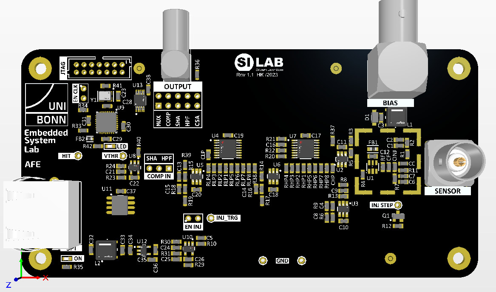

.. include:: replacements.rst
===========
Experiment: Analog Signal Processing for Semiconductor Sensors
===========

    Analog Front-end Module

The goal of this lab module is an understanding of the typical analog signal processing steps used for semiconductor charge signal read-out and the basic data acquisition and analysis methods. A discrete single channel analog front-end (AFE) chain will be used to analyse the functionality of each circuit block. In particular the characterisation of the noise performance and its dependence of circuit parameters will be discussed. The electrical interface to the AFE hardware will enable the injection of calibration charge signals, programming of circuit parameters, and the detection of hits. On the software side scan routines will be developed to set the circuit parameters of interest and read the AFE digital output response. Basic analysis methods will be introduced to extract performance parameters such as equivalent noise charge (ENC), charge transfer gain, linearity etc. Additionally, the fast ADC can be used to record analog waveforms for further analysis.

Signal Processing Overview
==========================
A typical analog read-out chain, also called analog front-end, for a semiconductor detector consists of a charge sensitive amplifier (CSA), a pulse shaping amplifier (SHA) and digitization circuit which simplest implementation is a comparator (COMP), as shown in the picture below. The CSA converts the charge signal of the connected detector diode to a voltage step equal to the ratio of signal charge and feedback capacitance (Qsig/Cf). The shaping amplifier acts on the CSA output as a signal filter with a bandpass transfer function. By adjusting its bandpass center frequency the signal-to-noise ratio of the signal processing chain can be optimized. The comparator compares the output of the shaped signal with a programmable threshold. When the input signal is above the threshold, the comparator output goes high and flags a signal hit to the digital read-out logic.

.. figure:: images/AFE_signal_flow.png
    :width: 600
    :align: center

    Generic read-out chain for a semiconductor detector: charge sensitive amplifier (CSA), pulse shaping amplifier (SHA), and comparator (COMP). Shown are typical signal waveforms between the blocks and the parameters which can be controlled for each block.

Circuit Implementation
======================
The simplified schematic in the figure below shows the implementation of the analog signal processing chain. The CSA is build around a low noise opamp which is feed-back with a small capacitance **Cf** and a large resistance **Rf**. The feedback capacitance **Cf** defines the charge transfer gain and the resistance **Rf** allows for a slow discharge of **Cf** and setting of the dc operation point of the opamp. To enable calibration and characterization measurements, an injection circuit is available to generate a programmable CSA input signal. On the rising edge of the digital **TRG_INJ** signal a negative charge of the size **Cinj** times the programmable voltage step amplitude **VINJ** is applied to the CSA input.

The shaping amplifier consists of a high pass filter (HPF) and a low pass filter (LPF) separated by a buffer amplifier which adds additional voltage gain *g* to the circuit. Both time constants of the HPF and LPF are controlled by selecting the respective resistor values for **Rhp** and **Rlp**. The control circuit sets the values such :math:`\tau_{SHA} = \tau_{HP} = \tau_{LP}`, i.e. the time constants for low pass filter and high pass filter are equal. It can be shown that in this case the SHA response to an input step function of the amplitude *Ucsa* is (for t >= 0) 

.. math::

  U_{SHA}(t) = U_{CSA} \cdot g \cdot \frac{t}{\tau_{SHA}} \cdot \exp{\frac{-t}{\tau_{SHA}}}.

The final block is the comparator (COMP) which compares the output signal of the shaping amplifier **SHA_OUT** with a programmable threshold voltage **VTHR**. When a signal arrives, the comparator output signal goes high as long as the shaper output is above the threshold. For a fixed threshold the length of the comparator output signal therefore is a function of the signal amplitude. Some systems detect this pulse width (aka TOT, time over threshold) to get a measure of the incident charge. The logic which latches the comparator output is implemented in a CPLD (Complex Programmable Logic Device). This IC is programmed as depicted in the schematic diagram below.

.. figure:: images/AFE_digital.png
    :width: 600
    :align: center

There is a set-reset flip-flop which is asychronously set by the output of the comparator **COMP**. The SR flip-flop output signal **HIT** stays high until it is reset by the **INJ** line going low. Parallel to the SR flip-flop the **COMP** signal enables an 8-bit counter which output is incremented by a 40 MHz clock signal **CLK** thereby measuring the comparator output pulse width (TOT, time-over-threshold). The **TOT** value can be read out via the SPI interface which is also implemented in the CPLD (**CS_B**, **SCLK** and **MISO**). The high to low transistion from **INJ** also resets the TOT counter.

A charge injection cycle would look like this:

0. Ensure **INJ** is low to reset **HIT** output and TOT counter.
1. Set threshold, injection level (and shaping constant) as required.
2. To trigger the injection of a negative charge signal switch **INJ** to high.
3. Poll for the **HIT** going high. Use a proper time-out period in case the injected signal is below threshold and no comparator output signal is generated.
4. If **HIT** is high store the information and read the TOT count via the SPI bus (optional).
5. Set **INJ** back to low to reset the **HIT** signal and the TOT counter.
6. Since the CSA also resonds to positive charge injection (**INJ** going low), wait for ~ 200 µs to allow the circuit to settle before triggering the next injection. 

The electrical interface to control the AFE consist of an 

* **SPI** interface which controls

  * SHA time constant by selecting resistor values via a multiplexer
  * digital to analog converter (DAC) which sets the injection step voltage **VINJ** and the comparator threshold **VTHR**

* **INJ** signal (**GPIO5**, from Rpi to AFE module) which triggers the injection signal and resets the comparator latch
* **HIT** signal (**GPIO4**, from AFE module to Rpi) for reading the digital hit output
  

.. figure:: images/AFE_simple_schematic.png
    :width: 600
    :align: center

    Simplified schematic of the analog front-end. **TRG_INJ** and **HIT_OUT** control the charge injection and digital hit readout, respectively. The **SPI** bus is used to program the DAC voltages **VTHR** and **VINJ** and select the SHA time constant.

The full AFE schematic is found here: :download:`AFE_1.1.pdf <documents/AFE_1.1.pdf>`

Data Acquisition and Analysis Methods
=====================================

A central performance parameter of an signal processing circuit is its signal-to-noise ratio (SNR) since it is directly related to the efficiency and accuracy of the detection process. A noiseless system would generate a comparator hit signal with 100 % probability if the signal is above threshold and always detect no hit if the signal is below threshold. In the presence of noise, however, the step-like response function of the comparator hit probability as a function of the difference between signal and threshold is smeared out. The following figure shows the comparator response probability of a real system and an ideal system. When the injected charge is equal to the comparator threshold (Q = QTHR) the hit probability is 50% in both cases. In a noiseless system the hit probability immediately goes to 0 % (100 %) for lower (higher) charge. The noise smooths out this transition region. Actually the knowledge of the slope at the 50 % probability mark allows the calculation of the noise. Mathematically, the response curve is given by a Gaussian error function (aka s-curve) which is the convolution of a step-function (the ideal comparator response) with a Gaussian probability distribution (representing the noise).

    Response probability of the comparator as a function of the signal charge. The ideal system (noiseless, blue curve) exhibits a step function while noise (red curve) will smear-out the transition. That results in a Gaussian error function which fitted parameter define threshold (50 % transition point) and noise (slope of the curve) of the system.

A typical data acquisition cycle for measuring an s-curve involves several steps. Here is a generic scan routine in pseudo code:

.. code-block:: python

  # initialize parameters
  SetThreshold(threshold) # set threshold to ~ 50% charge equivalent
  SetParameter(parameter) # set the circuit parameter to evaluate the response at (i.e. SHA time constant)
  SetTrgInj(0)            # reset comparator latch and injection step 

  # nested scan loops
    for (VINJ = (VINJmin, VINmax, VINstep)) # outer loop scans the signal charge
      SetInjectionVoltage(charge)   # set the injection voltage DAC
      for (i = (0, 100))  # inner loop repeats the charge injection a hundred times for each charge step
        SetTrgInj(1)      # trigger the charge injection via GPIO5
        Delay()           # short delay (~50 us) to allow the signal propagate through the circuit
        hit = GetHitOut() # read status of the hit_out signal GPIO4
        if hit            # update the hit count in a storage element for plotting and further analysis
         HitCount[charge] += 1
        SetTrgInj(0)      # reset the comparator latch and charge injection via GPIO5
        Delay()           # short delay (~50 us) to allow the circuit settle after the inject circuit reset
          
The dataset for the injection voltage scan will represent an s-curve which allows the extraction of the threshold and the noise. For a quantitative evaluation of the s-curve the injection voltage has to be converted to the equivalent injection charge QINJ. 

.. math::
  
  Q_{INJ}= k \cdot  V_{INJ} \cdot C_{INJ}

with *k* = 0.5 for the attenuation of the resistive divider in front of the injection switch and CINJ = 0.5 pF the injection capacitance which converts the voltage step into a charge.

.. math::
  
  Q_{INJ}[fC]= 0.25 [pF] \cdot V_{INJ}[mV]

Once the x-axis of the s-curve is converted to charge units also the threshold voltage can be calibrated and converted to charge units. This is done by measuring s-curves for different threshold voltages and plotting the resulting 50 % values (the effective threshold in charge units) as a function of the applied threshold voltage. The extracted slope is  the threshold calibration factor. This factor can also be interpreted a the charge to voltage gain of the read-out chain since it converts an input charge to an output voltage which is seen at the input of the comparator. Actually the scanning of the comparator threshold voltage allows the measurement of the shaper output peak amplitude, which is equivalent to the threshold voltage at which the comparator fires with 50 % probability.

This AFE signal processing chain allows the access to the analog shaping amplifier output signal. Therefor, the SHA waveform can be recorded with the fast ADC and analyzed on the Rpi. This method allows the direct measurement of the noise (i.e. the amplitude fluctuation of the baseline), the charge transfer gain and the shaping time constant (i.e. amplitude and peaking time of the SHA output pulse).

Exercises
=========

1. Waveform measurements
-------------------------

 - Implement charge injection 
 - Measure and analyze waveforms (CSA, SHA, COMP)
 - Measure shaping time constants

2. Characterization with the digital read-out
---------------------------------------------
 
 - Time over threshold 
 - S-curve 
 - Noise and threshold 
 
3. Performance measurements 
----------------------------
 
 - Noise vs. shaping time
 - Noise vs. detector capacitance
 
4. Implementation of a Multi Channel Analyzer
---------------------------------------------
 
