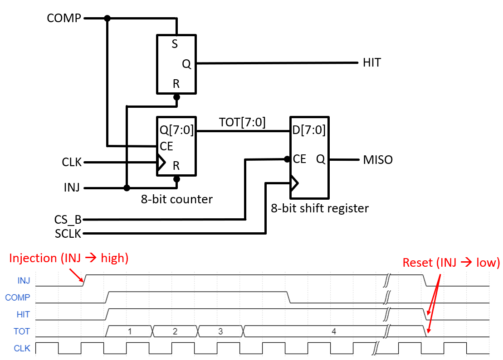

.. include:: replacements.rst
===========
Experiment: Analog Signal Processing for Semiconductor Sensors
===========

.. figure:: images/afe.png
    :width: 600
    :align: center

    Analog Front-end Module

The goal of this lab module is an understanding of the typical analog signal processing steps used for semiconductor charge signal read-out and the basic data acquisition and analysis methods. A discrete single channel analog front-end (AFE) chain will be used to analyze the functionality of each circuit block. In particular the characterization of the noise performance and its dependence of circuit parameters will be discussed. The electrical interface to the AFE hardware will enable the injection of calibration charge signals, programming of circuit parameters, and the detection of hits. On the software side scan routines will be developed to set the circuit parameters of interest and read the AFE digital output response. Basic analysis methods will be introduced to extract performance parameters such as equivalent noise charge (ENC), charge transfer gain, linearity etc. Additionally, the fast ADC can be used to record analog waveforms for further analysis.

Signal Processing Overview
==========================
A typical analog read-out chain, also called analog front-end, for a semiconductor detector consists of a charge sensitive amplifier (CSA), a pulse shaping amplifier (SHA) and digitization circuit which simplest implementation is a comparator (COMP), as shown in the picture below. The CSA converts the charge signal of the connected detector diode to a voltage step equal to the ratio of signal charge and feedback capacitance (Qsig/Cf). The shaping amplifier acts on the CSA output as a signal filter with a band-pass transfer function. By adjusting its band-pass center frequency the signal-to-noise ratio of the signal processing chain can be optimized. The comparator compares the output of the shaped signal with a programmable threshold. When the input signal is above the threshold, the comparator output goes high and flags a signal hit to the digital read-out logic.

    Generic read-out chain for a semiconductor detector: charge sensitive amplifier (CSA), pulse shaping amplifier (SHA), and comparator (COMP). Shown are typical signal waveforms between the blocks and the parameters which can be controlled for each block.

Circuit Implementation
======================
The simplified schematic in the figure below shows the implementation of the signal processing chain. The CSA is build around a low noise op-amp which is feed-back with a small capacitance **Cf** and a large resistance **Rf**. The feedback capacitance **Cf** defines the charge transfer gain and the resistance **Rf** allows for a slow discharge of **Cf** and setting of the dc operation point of the op-amp. To enable calibration and characterization measurements, an injection circuit is used to generate a programmable CSA input signal. On the rising edge of the digital **TRG_INJ** signal a negative charge of the size **Cinj** times the programmable voltage step amplitude **VINJ** is applied to the CSA input.

.. figure:: images/AFE_simple_schematic.png
    :width: 600
    :align: center

    Simplified schematic of the analog front-end. **INJ** and **HIT** control the charge injection and digital hit readout, respectively. The **SPI** bus is used to program the DAC voltages **VTHR** and **VINJ** and select the SHA time constant. The full AFE schematic is found here: :download:`AFE_1.1.pdf <documents/AFE_1.1.pdf>`

The shaping amplifier consists of a high pass filter (HPF) and a low pass filter (LPF) separated by a buffer amplifier which adds additional voltage gain :math:`g = 1000` to the circuit. Both time constants of the HPF and LPF are controlled by selecting the respective resistor values for **Rhp** and **Rlp**. The control circuit sets the values such :math:`\tau_{SHA} = \tau_{HP} = \tau_{LP}`, i.e. the time constants for low pass filter and high pass filter are equal. It can be shown that in this case the SHA response to an input step function of the amplitude :math:`Ucsa` is (for :math:`t \geq 0`) 

.. math::

  U_{SHA}(t) = U_{CSA} \cdot g \cdot \frac{t}{\tau_{SHA}} \cdot \exp{\frac{-t}{\tau_{SHA}}}.

Both analog control voltages **VTHR** and **VINJ** are generated by a 12-bit digital to analog converter (DAC). The maximum output voltage of the DAC is 2048 mV which corresponds to a LSB step size of 0.5 mV for **VTHR** and 0.05 mV for **VINJ**, respectively, taking into account the attenuation of the resistive divider in front of the injection capacitor.

The final analog block is the comparator (COMP) which compares the output signal of the shaping amplifier **SHA_OUT** with a programmable threshold voltage **VTHR**. When a signal arrives, the comparator output signal goes high as long as the shaper output is above the threshold. For a fixed threshold the length of the comparator output signal therefore is a function of the signal amplitude. Some systems detect this pulse width (aka TOT, time over threshold) to get a measure of the incident charge. The logic which latches the comparator output is implemented in a CPLD (Complex Programmable Logic Device). This logic IC can be programmed as depicted in the schematic diagram below.

    Digital logic implemented in the CPLD. The SR flip-flop is set by the comparator output going high while the 8-bit counter measures the comparator pulse width (time-over-threshold) which value can be read out the SPI interface. A low state of the **INJ** resets HIT signal and TOT counter.

There is a set-reset flip-flop which is asynchronously set by the output of the comparator **COMP**. The SR flip-flop output signal **HIT** stays high until it is reset by the **INJ** line going low. Parallel to the SR flip-flop the **COMP** signal enables an 8-bit counter which output is incremented by a 40 MHz clock signal **CLK** thereby measuring the comparator output pulse width (TOT, time-over-threshold). The **TOT** value can be read out via the SPI interface which is also implemented in the CPLD (**CS_B**, **SCLK** and **MISO**). The high to low transition from **INJ** also resets the TOT counter.

A charge injection cycle would look like this:

0. Ensure **INJ** is low to reset **HIT** output and TOT counter.
1. Set threshold, injection level (and shaping constant) as required.
2. Set **INJ** to high to trigger the injection of a negative charge signal.
3. Poll for the **HIT** going high. Use a proper timeout period in case the injected signal is below threshold and no comparator output signal would be generated.
4. If a high level of the **HIT** is detected store the information. If the (optional) TOT signal is to be acquired too, wait approx. 100 µs (the maximum detectable pulse width) to allow the counter to stop before being read-out.
5. Set **INJ** back to low to reset the **HIT** signal and the TOT counter.
6. Since the CSA also responds to positive charge injection (**INJ** going low), wait for ~ 200 µs to allow the circuit to settle before triggering the next injection. 

The electrical interface to control the AFE consist of an 

* **SPI** interface which controls

  * SHA time constant by selecting resistor values via a multiplexer
  * digital to analog converter (DAC) which sets the injection step voltage **VINJ** and the comparator threshold **VTHR**

* **INJ** signal (**GPIO5**, from Rpi to AFE module) which triggers the injection signal and resets the comparator latch
* **HIT** signal (**GPIO4**, from AFE module to Rpi) for reading the digital hit output
  

Data Acquisition and Analysis Methods
=====================================

A central performance parameter of an signal processing circuit is its signal-to-noise ratio (SNR) since it is directly related to the efficiency and accuracy of the detection process. A noiseless system would generate a comparator hit signal with 100 % probability if the signal is above threshold and always detect no hit if the signal is below threshold. In the presence of noise, however, the step-like response function of the comparator hit probability as a function of the difference between signal and threshold is smeared out. The following figure shows the comparator response probability of a real system and an ideal system. When the injected charge is equal to the comparator threshold (Q = QTHR) the hit probability is 50% in both cases. In a noiseless system the hit probability immediately goes to 0 % (100 %) for lower (higher) charge. The noise smooths out this transition region. Actually the knowledge of the slope at the 50 % probability mark allows the calculation of the noise. Mathematically, the response curve is given by a Gaussian error function (aka s-curve) which is the convolution of a step-function (the ideal comparator response) with a Gaussian probability distribution (representing the noise).

.. figure:: images/AFE_scurve.png
    :width: 400
    :align: center

    Response probability of the comparator as a function of the signal charge. The ideal system (noiseless, blue curve) exhibits a step function while noise (red curve) will smear-out the transition. That results in a Gaussian error function which fitted parameter define threshold (50 % transition point) and noise (slope of the curve) of the system.

A typical data acquisition cycle for measuring an s-curve involves several steps. Here is a generic scan routine in pseudo code:

.. code-block:: python

  # initialize parameters
  SetThreshold(threshold) # set threshold to ~ 50% charge equivalent
  SetParameter(parameter) # set the circuit parameter to evaluate the response at (i.e. SHA time constant)
  SetTrgInj(0)            # reset comparator latch and injection step 

  # nested scan loops
    for (VINJ = (VINJmin, VINmax, VINstep)) # outer loop scans the signal charge
      SetInjectionVoltage(charge)   # set the injection voltage DAC
      for (i = (0, 100))  # inner loop repeats the charge injection a hundred times for each charge step
        SetTrgInj(1)      # trigger the charge injection via GPIO5
        Delay()           # short delay (~50 us) to allow the signal propagate through the circuit
        hit = GetHitOut() # read status of the hit_out signal GPIO4
        if hit            # update the hit count in a storage element for plotting and further analysis
         HitCount[charge] += 1
        SetTrgInj(0)      # reset the comparator latch and charge injection via GPIO5
        Delay()           # short delay (~50 us) to allow the circuit settle after the inject circuit reset
          
The dataset for the injection voltage scan will represent an s-curve which allows the extraction of the threshold and the noise. For a quantitative evaluation of the s-curve the injection voltage has to be converted to the equivalent injection charge QINJ. 

.. math::
  
  Q_{INJ}= k \cdot  V_{INJ} \cdot C_{INJ}

with *k* = 0.1 for the attenuation of the resistive divider in front of the injection switch and CINJ = 0.1 pF the injection capacitance which converts the voltage step into a charge.

.. math::
  
  Q_{INJ}[fC]= 0.01 [pF] \cdot V_{INJ}[mV]

Once the x-axis of the s-curve is converted to charge units also the threshold voltage can be calibrated and converted to charge units. This is done by measuring s-curves for different threshold voltages and plotting the resulting 50 % values (the effective threshold in charge units) as a function of the applied threshold voltage. The extracted slope is  the threshold calibration factor. This factor can also be interpreted a the charge to voltage gain of the read-out chain since it converts an input charge to an output voltage which is seen at the input of the comparator. Actually the scanning of the comparator threshold voltage allows the measurement of the shaper output peak amplitude, which is equivalent to the threshold voltage at which the comparator fires with 50 % probability.

This AFE signal processing chain allows the access to the analog shaping amplifier output signal. Therefor, the SHA waveform can be recorded with the fast ADC and analyzed on the Rpi. This method allows the direct measurement of the noise (i.e. the amplitude fluctuation of the baseline), the charge transfer gain and the shaping time constant (i.e. amplitude and peaking time of the SHA output pulse).

Exercises
=========

The exercises are grouped into three parts. In the first part the basic functionality of the analog front-end is tested. This is accomplished by implementing a script to enable the charge injection and to observe waveforms of the charge sensitive amplifier, shaper, and comparator with an external oscilloscope and/or the fast ADC on the Raspberry Pi base board. In the second part methods to extract analog performance parameters from the digital hit information will be developed. Finally, the full analog signal processing chain will be characterized as a function of shaping time and detector capacitance. 

The exercise 0 contains preparatory questions that should be answered before coming to the lab.

.. admonition:: Exercise 0. Preparatory questions

  #. The injection circuit generates a charge signal of the size :math:`C_{inj} \cdot V_{inj}`. What is the charge in femto Coulomb generated by a voltage step of 100 mV with :math:`C_{inj} = 0.1 pF`? What is the charge step size for :math:`V_{inj} = 0.5 mV` which corresponds to the LSB size of the voltage DAC? Also calculate the values in units of the elementary charge (electrons).
  #. An ideal charge sensitive amplifier generates a step-like output waveform in response to an instantaneous charge signal at the input. What is the **CSA** output step amplitude for an input charge of 1 fC given the feedback capacitance of 1 pF? How is the charge transfer gain defined and what is the unit of the charge transfer gain?
  #. A shaping amplifier responds with a characteristic output pulse to a step-like input waveform. What is the peak pulse amplitude for a input step with a unit amplitude (i.e. 1 V)? Assume a CR-RC (high-pass + low-pass filter) with equal time constants.
  #. What is the total charge sensitivity of the analog front-end chain (CSA + SHA) i.e., peak amplitude in mV at the shaper output per fC (or electron) charge at the CSA input? 
  #. The threshold voltage to detect a signal with the comparator is set by a DAC with an LSB size of 0.5 mV. What is the equivalent LSB size in fC or electrons?
  #. An amplitude histogram of an ideal noise-free system would consist of a delta-like peaks for the baseline and the shaped signal produced by a constant input charge. In a real system, however, noise is overlaying the ideal signals, leading to fluctuations of the analog amplitudes. Modify the amplitude histogram to reflect these fluctuation (assume a Gaussian distribution of the noise).
  #. The threshold of the comparator should be set in a way, that the noise is suppressed and only the signals are detected. Draw an optimum threshold in your amplitude histogram. What would happen if the threshold was too low, what would happen if it was too high? How are purity and efficiency of the detection process defined in this context? What happens if baseline and signal fluctuations are getting to close to each other?
  #. What is the equivalent noise charge (ENC) in fC for a noise amplitude of 10 mV given the charge sensitivity calculated above?
  #. How are a Gaussian distribution and error-function related. How can one extract the width (sigma) and the mean (lambda) of the underlying Gaussian distribution from a measured error function?

.. admonition:: Exercise 1. Waveform measurements

  #. Implement a script to continuously inject constant charge pulses into the CSA. To change configuration parameters (injection amplitude, time constants, output channel of the signal monitor multiplexer) while injecting, use threading to run the injection loop in parallel to the configuration loop (see ``threads.py`` as an example for using threads in Python).
  #. What happens if the charge injections are too fast? What time constants do you have to take into account to estimate the maximum injection frequency?
  #. Run your injection script and observe the different signals (CSA, high-pass filter, shaper, and comparator) while varying the injected charge amplitude, shaper time constants, and comparator threshold. What happens if high-pass and low-pass time constants are not equal? What if the injection is too high or too low? 
  #. Select a injection amplitude which is well within the dynamic range of the system (i.e. no amplitude clipping) and measure the peaking time as a function of the shaper time constant for equal high-pass and low-pass time constants. Does the peak amplitude change with the peaking time? Give possible explanations.

.. admonition:: Exercise 2. Characterization with the digital read-out

  #. Now select the comparator output with the monitor multiplexer. Set a threshold which is roughly at the middle of the shaper peak amplitude (the **Vthr** DAC gain is 0.5 mV/DAC step). Observe the pulse width of the comparator output (time-over-threshold, TOT) for different injection amplitudes. What relation between TOT and injected charge would you expect? An automated TOT measurement can be implemented by using the hit signal to start and stop a timer. This will be implemented later with the FPGA lab module.
  #. Implement a scan routine to measure the s-curve of the system. The s-curve is obtained by measuring the hit probability as a function of the injected charge. The charge is varied by changing the injection voltage. The hit probability is calculated by counting the number of hits for a given charge step in relation to the total number of injections. 
  #. Use the measured s-curve to extract the threshold (50 % value) and the noise (slope at the 50 % point). Repeat for different system settings.

 
.. admonition:: Exercise 3. Noise performance measurements 

  #. Acquire s-curves for different shaping time constants. What is the effect of the shaping time on the noise? Do not yet connect a sensor diode to the CSA.
  #. Now connect a sensor diode to the CSA and apply 20 V bias voltage. Repeat the s-curves measurements. What happens if you lower the bias voltage? What is the effect of the detector capacitance on the noise performance?
  #. Connect various test capacitors instead of the sensor diode and plot the noise vs. input capacitance. Repeat the measurements for different shaping time constants.

 
