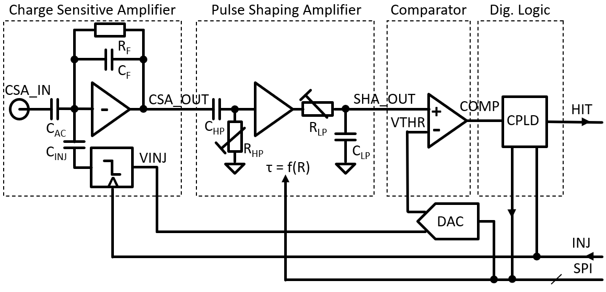

===========
Experiment: Analog Front-end for semiconductor sensors
===========
Signal Processing for Semiconductor Detectors
---------------------------------------------
The goal of this lab module is an understanding of the typical analog signal processing steps used for semiconductor charge signal read-out and the basic data acquisition and analysis methods. A discrete single channel analog front-end (AFE) chain will be used to analyse the functionality of each circuit block. In particular the characterisation of the noise performance and its dependence of circuit parameters will be discussed. The electrical interface to the AFE hardware will enable the injection of calibration charge signals, programming of circuit parameters, and the detection of hits. On the software side scan routines will be developed to set the circuit parameters of interest and read the AFE digital output response. Basic analysis methods will be introduced to extract performance parameters such as equivalent noise charge (ENC), charge transfer gain, linearity etc.

A typical analog read-out chain, also called analog front-end, for a semiconductor detector consists of a charge sensitive amplifier (CSA), a pulse shaping amplifier (SHA) and digitization circuit which simplest implementation is a comparator (COMP), as shown in the picture below. The CSA converts the charge signal of the connected detector diode to a voltage step equal to the ratio of signal charge and feedback capacitance (Qsig/Cf). The shaping amplifier acts on the CSA output as a signal filter with a bandpass transfer function. By adjusting its bandpass center frequency the signal-to-noise ratio of the signal processing chain can be optimized. The comparator compares the output of the shaped signal with a programmable threshold. When the input signal is above the threshold, the comparator output goes high and flags a signal hit to the digital read-out logic.

.. figure:: images/AFE_signal_flow.png
    :width: 600
    :align: center

    Generic read-out chain for a semiconductor detector: charge sensitive amplifier (CSA), pulse shaping amplifier (SHA), and comparator (COMP). Shown are typical signal waveforms between the blocks and the parameters which can be controlled for each block.

Circuit Implementation
----------------------
The CSA is build around a low noise opamp which is feed-back with a small capacitance **Cf** and a large resistance **Rf**. The feedback capacitance **Cf** defines the charge transfer gain and the resistance **Rf** allows for a slow discharge of **Cf** and setting of the dc operation point of the opamp. To enable calibration and characterization measurements, an injection circuit is available to generate a programmable CSA input signal. On the rising edge of the digital **TRG_INJ** signal a negative charge of the size **Cinj** times the programmable voltage step amplitude **VINJ** is applied to the CSA input.

The shaping amplifier consists of a high pass filter (HPF) and a low pass filter (LPF) separated by a buffer amplifier. Both time constants of the HPF and LPF are controlled by selecting the respective resistor values for **Rhp** and **Rlp**. The control circuit sets the values such tau_hp = tau_lp (Chp = Clp, and Rhp = Rlp), i.e. the time constants for low pass filter and high pass filter are equal. It can be shown that in this case the SHA response to a step function of **CSA_OUT** is SHA(t) = t/tau * exp(-t/tau).

The final block is the comparator (COMP) which compares the output signal of the shaping amplifier **SHA_OUT** with a programmable threshold voltage **VTHR**. When a signal arrives, the comparator output signal goes high as long as the SHA output is above the threshold. For a fixed threshold the length of the comparator output signal therefore is a function and the signal amplitude. Some systems detect this pulse width (aka TOT, time over threshold) to get a measure of the incident charge. To enable the hit detection with polling the GPIO pins, the comparator output is asynchronously latched with a flip flop. Its output signal **HIT_OUT** is then finally read by the GPIO interface. Before the latched comparator is able to detect new hits, it needs a reset by puling the **TRG_INJ** signal low. 

The electrical interface to control the AFE consist of an 

* **SPI** interface which controls

  * SHA time constant by selecting resistor values via a multiplexer
  * digital to analog converter (DAC) which sets the injection step voltage **VINJ** and the comparator threshold **VTHR**

* **TRG_INJ** signal (**GPIO5**, from Rpi to AFE module) which triggers the injection signal and resets the comparator latch
* **HIT_OUT** signal (**GPIO4**, from AFE module to Rpi) for reading the digital hit output
  

    Simplified schematic of the analog front-end. **TRG_INJ** and **HIT_OUT** control the charge injection and digital hit readout, respectively. The **SPI** bus is used to program the DAC voltages **VTHR** and **VINJ** and select the SHA time constant.

The full AFE schematic is found here: :download:`AFE_1.0.pdf <documents/AFE_1.0.pdf>`

Data acquisition and analysis methods
-------------------------------------
A central performance parameter of an signal processing circuit is its signal-to-noise ratio (SNR) since it is directly related to the efficiency and accuracy of the detection process. A noiseless system would always generate a comparator hit signal when the signal is above the set threshold. In the presence of noise, however, the step-like response function of the comparator hit probability as a function of the difference between signal and threshold is smeared out. The following figure shows the comparator response probability of a real system and an ideal system. When the injected charge is equal to the comparator threshold (Q = QTHR) the hit probability is 50% in both cases. In a noiseless system the hit probability immediately goes to 0 % (100 %) for lower (higher) charge. The noise smooths out this transition region. Actually the measuring the slope of the curve at the 50 % probability mark allows the calculation of the noise. Mathematically, the response function is a so called error function (aka s-curve) which is generated by the convolution of a step-function (the ideal comparator response) with a Gaussian probability distribution (representing the noise).

.. figure:: images/AFE_scurve.png
    :width: 400
    :align: center

    Response probability of the comparator as a function of the signal charge. The ideal system (noiseless, blue curve) exhibits a step function while noise (red curve) will smear-out the transition. That results in a Gaussian error function which fitted parameter define threshold (50 % transition point) and noise (slope of the curve) of the system.

TEST

 - Charge injection 
 - S-curve measurements
 - Noise vs. SHA_tau / CSA_input load
 - Multi Channel Analyzer
 
