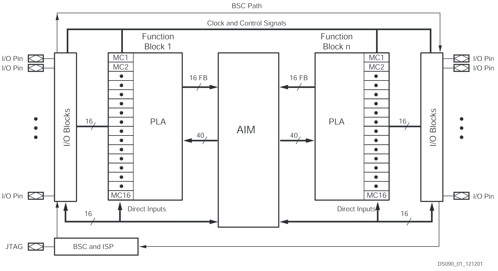
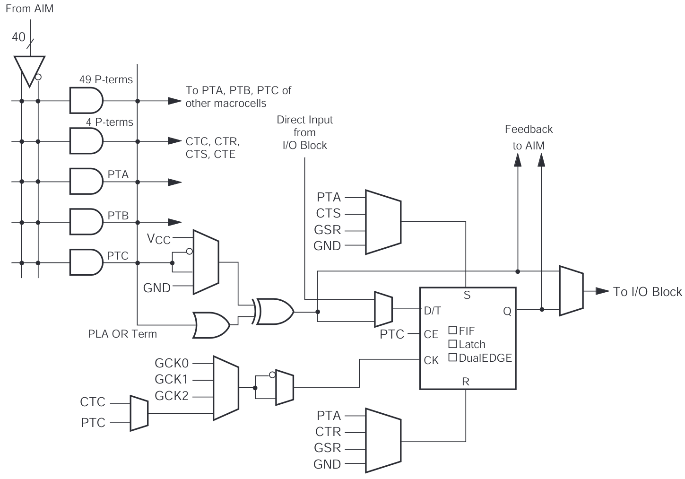

=====================================
CPLD/FPGA Programming
=====================================

The AFE module contains an XC2C32A CoolRunner-II CPLD which handles the configuration of shaping times (I/O expander functionality) and the injection timing. The latter is only possible due to the deterministic properties of programmable hardware. In contrast to imprecise timing in software (e.g. sleep functions), CPLDs and FPGAs are not affected by the overhead that comes with operating systems where several thousand threads compete for CPU time. Programmable hardware can implement design entities with exactly the required number of input conditions and without unpredictable interaction with other parts of the design. The reaction time is determined by the internal propagation delays of gates and routing resources.

  **Architecture Description**
  CoolRunner-II CPLD is a highly uniform family of fast, low power CPLDs.
  The underlying architecture is a traditional CPLD architecture combining
  macrocells into Function Blocks (FBs) interconnected with a global routing
  matrix, the Xilinx Advanced Interconnect Matrix (AIM).
  The FBs use a Programmable Logic Array (PLA) configuration which allows
  all product terms to be routed and shared among any of the macrocells of
  the FB.
  Design software can efficiently synthesize and optimize logic that is
  subsequently fit to the FBs and connected with the ability to utilize a very
  high percentage of device resources.
  -- CoolRunner-II CPLD Family Data Sheet (DS090)



    CoolRunner-II CPLD Architecture

The XC2C32A offers 32 macrocells, each containing programmable logic and one flip-flop. In contrast to FPGAs, CPLD are not based on LUTs. The logic is implemented in PLA arrays, constructed from a programmable AND array, followed by a programmable OR array.



    CoolRunner-II CPLD Macrocell


Environment setup
=================

The development of FPGA (or CPLD) firmware requires software tools (Xilinx ISE, integrated development environment) that are not available for a Raspberry Pi. Therefore, a remote Linux machine will be used to compile the firmware. The output of the design implementation will be a binary file that can be loaded into the CPLD using a JTAG interface. Follow these steps to setup the development environment:

1. The folder ``/home/pi/Embedded-System-Lab/code/AFE/CPLD`` has a subfolder called ``ISE`` that contains the required files and scripts for the design implementation. This folder should be copied to your work folder ``/home/pi/work``.

2. Open a terminal and go to ``/home/pi/work/ISE``. There is a script called ``connect_remote_host.sh`` that will connect to a remote Linux machine hosting the Xilinx ISE design environment. The script will also mount your local folder ``/home/pi/work/ISE`` at the Linux host file system. Run the script by typing:

  .. code-block:: bash

    ./connect_remote_host.sh

Type ``pwd`` to check if the folder is mounted correctly. The output should be  ``/home/pi/pilab<xy>-remote`` where <xy> is the number of the local Raspberry Pi. The command ``ls`` should list the folder ``ISE`` and any other content of your local work folder. Keep the terminal session open, you will need it for the design implementation.


Test bench
=================

Test benches (tb) are environments in which the functionality of digital designs can be verified. They instantiate the unit- or device under test (UUT/DUT) and provide means to generate input signals and record output responses of the DUT.

If FPGA hardware building blocks like clock management, IO buffers, BRAM etc. are used in a synthesizable design, they can be instantiated from Xilinx standard libraries. The design tools configure and route these blocks automatically during synthesis. Typically the libraries also provide simulation models for these blocks (also referred to as "primitives") but here we write one from scratch. 

In this example, we make use of BUFG, an architecture-independent global buffer which distributes clock signals throughout a PLD. The synthesis software converts each BUFG to an appropriate type of global buffer for the target PLD device.
A brief description of this basic design element can be found in the Xilinx online documentation (https://docs.amd.com/r/en-US/ug953-vivado-7series-libraries/BUFG).
The complexity of simulation models can vary a lot and is defined by the requirements. For this testbench, it is sufficient to write a very simple behavioral model.

.. admonition:: Exercise 1: BUFG

  #. Write a Verilog module "BUFG" (filename e.g. ``BUFG.v``) with the same IO pin names and basic functionality (hint: one-liner), that can be used within the simulation. Include the module in the ``afe_tb.v`` testbench (e.g. ```include "BUFG.v"``).


Simulation
=================

Behavioral simulation of HDL code is an essential part of digital design. The goal is to verify that the code implements the intended behavior under different conditions. Note: Timing due to propagation delays is not taken into account during this stage of verification and requires a dedicated timing analysis.

Icarus Verilog is a fast open source simulation tool. It does not parse the HDL code during runtime, but instead utilizes a compiler to convert Verilog to an intermediate netlist format. This file is loaded by the runtime engine to run the simulation. 

  afe_tb.v + afe.v -->[iverilog compiler]--> afe.vvp -->[runtime simulator]--> afe.vcd

Start the compiler and the simulator from your ISE directory. The generated vcd waveform files can be opened with gtkwave.

  .. code-block:: bash

    iverilog -o afe.vvp afe_tb.v
    vvp afe.vvp
    gtkwave afe.vcd

.. admonition:: Exercise 2: Waveforms

  #. Try to interpret the waveforms and find the corresponding code lines in the testbench and source files. You can add internal signals from instantiated modules using the `[instancename].[signalname]`-notation.


ToT Counter
=================

The Time-Over-Threshold method yields information about the injected charge by measuring for how long the sensor signal amplitude was above the set threshold. In other words, for how long the comparator output signal is high.

A straightforward method to measure this time interval involves using a binary counter. The counter increments with each cycle of the fast clock (``CLK``), as long as the comparator output is high. The counter should be reset when the injection cycle is complete i.e. ``INJ_IN`` is low. Due to limited resources of our CPLD, a reasonable counter width is 8 bits.

  What is the achievable ToT range and timing resolution? Can it be improved and what are the limitations?

To read the counter value with the RPi, the partially implemented SPI protocol needs to be extended.
A description of the SPI protocol can be found in the :ref:`gpio-interface` chapter. The ``MISO``signal is used to transfer serialized data, one bit per SPI clock cycle (``SCLK``). ``CS_B`` is controlled by the RPi and determines whether data is written to the CPLD (``CS_B == 1``) or read from it (``CS_B == 0``). 

.. admonition:: Exercise 3: ToT counter

  #. Implement a ToT counter and modify the SPI code to transmit the counter value. The pointer register (``ptr``) can be used to serialize the tot counter register by selecting one bit of the vector. Extend the existing ``MISO`` assignment to transfer the tot-counter when ``CS_B`` is low.
  #. Verify your changes in simulation.


Design implementation and CPLD programming
==========================================

The development of the digital logic can now be done on the local Raspberry Pi while the design implementation will be executed with the Xilinx ISE tool chain on the remote machine:

1. Edit the Verilog code in the ``afe.v`` file in your local work folder according to your design ideas. Save the file and call the design implementation script by typing into the terminal (the one with the ssh session to the remote Linux machine):
 
  .. code-block::
  
    ./implement_design.sh

  The script will execute a sequence of tasks following the CPLD design flow: 

  * Design synthesis
  * Translation
  * Fitting (place and route)
  * Programming file generation 

  Examine the output messages. If all tasks are executed without errors, an output file ``afe.xsvf`` will be generated in the folder ``/home/pi/work/ISE``. This file will be used in the next step to program the CPLD.

2. Now you can use the JTAG programming tool ``jtag_programmer`` to program the CPLD (you will need a special cable to connect the CPLD's JTAG interface to the GPIO port of the Raspberry Pi). The programming tool is located in the folder ``/home/pi/Embedded-System-Lab/code/AFE/jtag_programmer``. To execute the tool on the local Raspberry Pi, open a new terminal and type:

  .. code-block::
  
    sudo -E /home/pi/Embedded-System-Lab/code/AFE/CPLD/jtag_programmer/jtag_programmer /home/pi/work/ISE/afe.xsvf

  If you see ``SUCCESS - Completed XSVF execution.`` at the end of the messages the CPLD has been programmed successfully.


ToT measurement
=================

Connect a BPW34 diode to the AFE board and set the "CLK_EN" jumper.

.. admonition:: Exercise 4: ToT measurement

  #. Test the counter with the ToT functions (e.g. ``tot_scan()`` or ``tot_histrogram()``) in ``afe_solution.py``. What information do you gain compared to a simple binary implementation (hit / no-hit) and for which type of measurement could this be useful?
