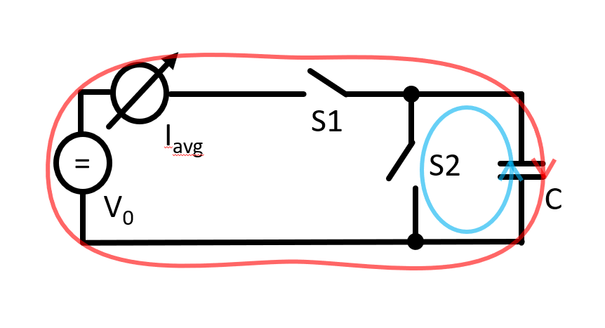
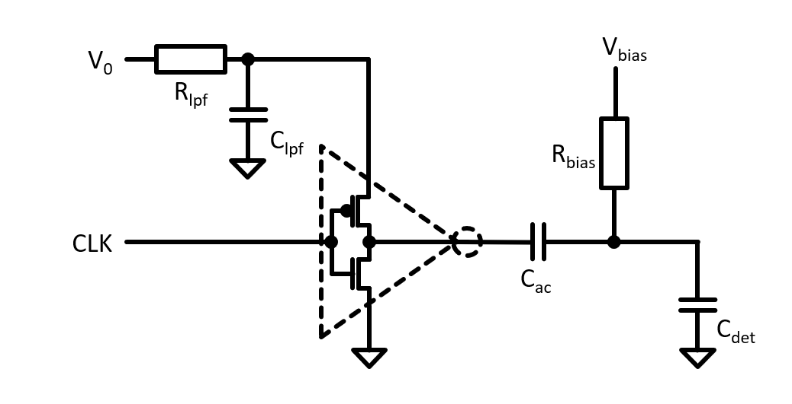

============================================
Experiment: Capacitance Measurement
============================================

.. figure:: images/cvm.png
    :width: 300
    :align: center

    CV-Meter Module

This experiment uses the C-V meter module to characterise the capacitance of a sensor diode. The measurement is based on the charge-based capacitance measurement (CBCM) technique which is capable of measuring capacitance with a resolution of a few pF. The CBCM method measures an average current which is generated by periodically charging and discharging the capacitance with a constant voltage amplitude. A simplified block diagram of the measurement circuit is shown here: 

    Simplified diagram of a charge-based capacitance measurement circuit. When switch S1 is closed and S2 is open, the capacitance is charged with a constant voltage amplitude V0 (current path shown in red). When S1 is open and S2 is closed, the capacitance is discharged (current path shown in blue). The average current generated from the periodic charging phases is measured and used to determine the value of the capacitance C.

The switches which control the charging and discharging of the capacitance are steered in a way that only the current from the charging phase is measured (i.e. either S1 or S2 are closed at a time). This leads to an expression for the average current which is proportional to the capacitance, the clock frequency, and the voltage amplitude:

.. math::
  
  I_\text{avg} = C \cdot V_{0} \cdot f_\text{CLK} +   I_\text{leak}. 

The term :math:`I_\text{leak}` represents any leakage current of the capacitance, which in particular, for measuring the pn-junction of a sensor diode, cannot be neglected. To suppress this term, the capacitance can be extracted from the slope factor which is derived from the measured current as a function of the clock frequency. The slope factor is given by:

.. math::

  S = \frac{dI_\text{avg}}{d(f_\text{CLK})} = C \cdot V_{0}.

and therefore

.. math::

  C = \frac{S}{V_{0}}.

  
Circuit Implementation 
----------------------
The switches for charing and discharging the capacitance are implemented with a CMOS inverter. The power supply of the inverter is connected via an RC low-pass filter to the voltage source :math:`V_0` and the inverter input is connected to a GPIO signal with programmable frequency. The low-pass filter smooths the current transients during the charing phase and thus allows the measurement of the average current. The output of the inverter is connected to the capacitance under test. To characterise the (bias-) voltage dependence of a sensor diode capacitance, the output of the CBCM circuit is ac-coupled. That allows the connection of a bias voltage source to the detector diode. A large series resistor R_bias (1 Meg Ohm) isolates the bias voltage source from the CBCM circuit. 

    Simplified schematic of the CVM module. The switches are implemented with a CMOS inverter where the NMOS transistor is closed and the PMOS is open during the discharge phase (CLK = high) and the NMOS transistor is open and the PMOS is closed during the charging phase (CLK = low). 

To apply the voltage :math:`V_0` and to measure the current, an SMU-module can be used. The voltage :math:`V_0` should be chosen such that the PMOS and NMOS transistors in the CMOS inverter are not switched on at the same time. If :math:`V_0` is chosen too high (> 2 times the threshold voltage of a transistor), both transistors will be conducting during an input clock transition which will deteriorate the measurement. If the voltage is chosen too small, the measured current will be small and thus more affected by noise. 1.5 V has been found to be a good compromise for the CBCM measurement.	

Exercises 
---------

There is a script ``cvm.py`` in the folder ``code\CVM`` which contains the necessary includes, the basic configuration for implementing a programmable clock with one of the GPIO pins and code for taking capacitance measurements with the SMU module. Copy it into your ``work`` folder and use it as a template for your scripts. There is also another file called ``cvm_solution.py`` which contains working code for most of the exercises. Note that this should only be used for reference or as a last resort if you got stuck.

The clock configuration for the CVM module requires to call a C-library which needs ``root`` privileges. Therefore, once you navigated to your ``work`` directory, you need to start the script with the following command:

.. code-block:: text

    sudo -E python cvm.py

Exercise 0 should be solved before coming to the lab.

.. admonition:: Exercise 0. Preparatory questions

  #. To measure the average of the periodic charge current, an RC low-pass filter is used. The resulting voltage drop over the :math:`R_\text{lpf}` resistor will reduce the effective charge voltage. How would you need to modify the equation above to compensate for this effect? (Hint: If :math:`I_\text{avg}'` denotes the measured current, estimate the correction factor :math:`\frac{I_\text{avg}}{I_\text{avg}'}`.)
  #. The ac-coupling capacitor should be much larger than the capacitance under test to not influence the measurement. If this is not the case, how would you calculate the real capacitance from the measured value?
  #. Give the formula of the depletion width of a pn-junction. How does the capacitance of a pn-junction depend on the bias voltage (assume a plate capacitor configuration)? And how would one plot the voltage dependent capacitance as a linear function?

.. admonition:: Exercise 1. Preparation and test of the measurement setup
    
  #. Connect the CVM module to the base board witch an RJ-45 cable and modify the ``cvm.py`` script such that GPIO pin 4 generates a 100 kHz clock signal. Connect an oscilloscope probe to GPIO4 test pin at the Embedded-System-Lab base board and measure the clock frequency.
  #. Connect the SMU module to the base board with an flat-ribbon cable and adjust the script such that the SMU module is set to source a voltage of 1.5 V. Measure the voltage with a DVM.
  #. Connect the output of the SMU module to the input of the CVM module with a LEMO cable and measure the SMU current. Don't connect a test capacitor yet. Calculate the parasitic capacitance from the measured current.
  #. Now modify the script that it scans the clock frequency from 100 kHz to 1 MHz in steps of 100 kHz and measures the current for each frequency step. Plot the measured current as a function of the clock frequency. Calculate the slope factor and the parasitic capacitance of CVM circuit. Compare this measured value with the value from the previous measurement (the one at a fixed 100 kHz clock frequency). How large is the static leakage current?
