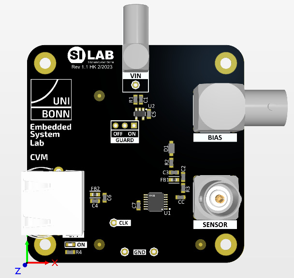

===========
Experiment: Capacitance Measurement
===========

    CV-Meter Module

This experiment uses the C-V meter module to characterise the voltage dependent capacitance of a sensor diode. The measurement is based on the charge-based capacitance measurement (CBCM)technique which is capable of measuring capacitance with a resolution of a few pF. The CBCM method measures an average current which is generated by periodically charging and discharging the capacitance with a constant voltage amplitude. The switches which control the charging and discharging of the capacitance are steered in a way that only the current from the charging phase is measured. This leads to an expression for the average current which is proportional to the capacitance, the clock frequency, and the voltage amplitude:

.. math::
  
  I_{CBCM} = C_{DET} \cdot V_{0} \cdot f_{CLK}. 

The capacitance can be extracted from the slope factor which is derived from the measured current as a function of the clock frequency. The slope factor is given by:

.. math::

  S = \frac{dI_{CBCM}}{d(f_{CLK})} = C_{DET} \cdot V_{0}.

and therefore

.. math::

  C_{DET} = \frac{S}{V_{0}}.

