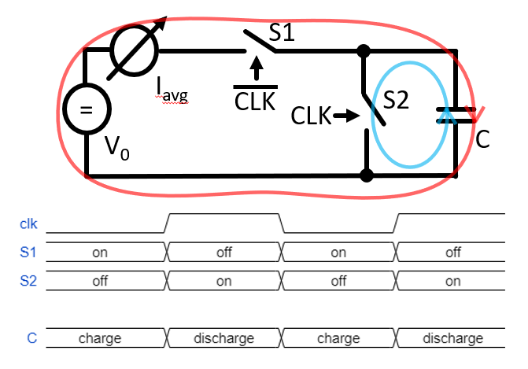

===========
Experiment: Capacitance Measurement
===========

.. figure:: images/cvm.png
    :width: 300
    :align: center

    CV-Meter Module

This experiment uses the C-V meter module to characterise the capacitance of a sensor diode. The measurement is based on the charge-based capacitance measurement (CBCM) technique which is capable of measuring capacitance with a resolution of a few pF. The CBCM method measures an average current which is generated by periodically charging and discharging the capacitance with a constant voltage amplitude. A simplified block diagram of the measurement circuit is shown here: 

    Simplified diagram of a charge-based capacitance measurement circuit. When switch S1 is closed and S2 is open, the capacitance is charged with a constant voltage amplitude V0 (current path shown in red). When S1 is open and S2 is closed, the capacitance is discharged (current path shown in blue). The average current generated from the periodic charging phases is measured and used to determine the value of the capacitance C.

The switches which control the charging and discharging of the capacitance are steered in a way that only the current from the charging phase is measured (i.e. either S1 or S2 are closed at a time). This leads to an expression for the average current which is proportional to the capacitance, the clock frequency, and the voltage amplitude:

.. math::
  
  I_{avg} = C \cdot V_{0} \cdot f_{CLK} +   I_{leak}. 

The term I_leak represents any leakage current of the capacitance which in particular for the measurement the pn-junction of a sensor diode cannot be neglected. To suppress this term, the capacitance can be extracted from the slope factor which is derived from the measured current as a function of the clock frequency. The slope factor is given by:

.. math::

  S = \frac{dI_{avg}}{d(f_{CLK})} = C \cdot V_{0}.

and therefore

.. math::

  C = \frac{S}{V_{0}}.

  
Circuit Implementation 
----------------------
The switches for charing and discharging the capacitance are implemented with a CMOS inverter. The power supply of the gate is connected to the voltage V0 and the input is connected to a GPIO signal with programmable frequency. The output of the inverter is connected to the capacitance under test. To characterise the (bias-) voltage dependence of a sensor diode capacitance, the output of the CBCM circuit is ac-coupled. That allows the connection of a bias voltage source to the detector diode. A large series resistor is the bias path (1 Meg Ohm) isolates the bias voltage source from the CBCM circuit. 

To apply the voltage V0 and to measure the current, an SMU-module can be used. The voltage V0 should be chosen such that the transistors in the CMOS inverter are not switched on at the same time. If V0 is chosen too high (> 2 times the threshold voltage of a transistor), both transistors will be conducting during an input clock transition which will deteriorate the measurement. If the voltage is chosen too small, the measured current will be small and thus more affected by noise. 1.5 V has been found to be a good compromise for the CBCM measurement.	

