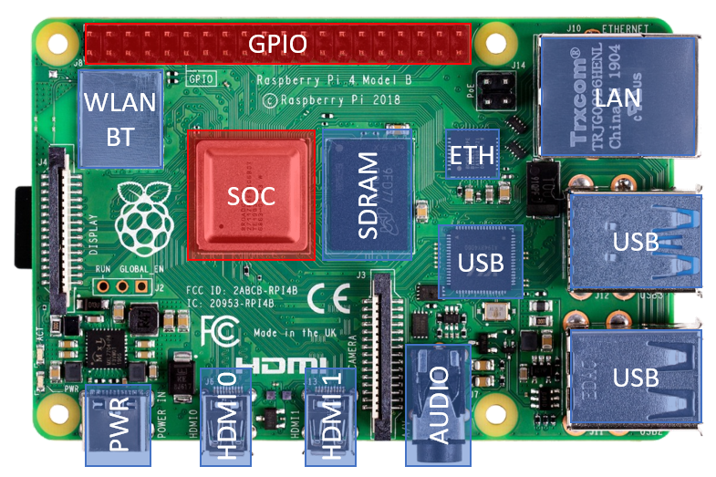

========================
Embedded System Hardware
========================
This chapter introduces the computing hardware which is used in all experiments. Although the specific details of the following description relate to the Raspberry Pi platform, the fundamental aspects of interaction between software, system hardware and external devices are platform independent. The first section describes the Raspberry Pi hardware with a focus on the access to the GPIO ports. The second section gives an overview of commonly used serial protocols for communication between systems and electronic components. Finally, programming examples are presented and simple tasks which introduce the first experiment (GPIO Programming) are shown.

Computing Platform
------------------
The central part of the Raspberry Pi module is a system-on-chip (SOC). A SOC integrates the CPU with peripheral components like display controller, various communication interfaces (USB, Ethernet, PCIe, etc.), memory controller, power regulators and others on a single chip. Therefore, only very few external components are needed to build a complete computing system. The picture belows shows the Raspberry Pi 4B module with the central SOC, the SDRAM memory, an on-board Wifi & BT transceiver, support chips for Ethernet and USB, connectors for video, audio, LAN , USB and a header for the GPIO port.

The Raspberry Pi SOC is based on a highly integrated, low power video processor called VideoCore (sometimes also referred to as graphics- or video-processing-unit, GPU or VPU) with a multi-core ARM CPU attached to it. The following block diagram of the BCM2711 chip, which is used on the Raspberry Pi 4 modules, shows the SOC main function blocks which communicate and exchange data via an internal system bus (AMBA/AXI bus). 

Memory and I/O Access
---------------------
The operation system and the user programs run on a quad-core CPU (ARM Cortex A-72) while video data processing is handled by VideoCore VPU. Both the CPU and the VPU share the same system memory and peripheral components attached to the system bus. The address handling and arbitration is done by so-called memory management units (MMU). One MMU manages the resource sharing between CPU and VPU (VC/ARM MMU) while the other MMU (ARM MMU) maps memory and I/O peripherals to virtual user- and kernel-address space. The following block diagram shows the relations between the different address spaces:

The center column shows the address space as seen by the CPU. The system memory (implemented as synchronous random access memory, SDRAM) starts at address ``0x00000000`` and occupies a range according to the amount of memory available on the module (1 GB, 2 GB, 4 GB, or 8 GB). The I/O peripherals registers start at the address offset ``PHYS_REG_BASE`` which depends on the SOC version (see table below). The actual access to memory or I/O resources is managed via the VPU MMU. In the left column the address space of the VPU is shown. The VPU address space is four times larger than the physical address space which enables aliasing. That means that different access modes for the same physical address can be used. Depending on the chosen alias offset, the access is cached is various ways (L1 + L2, or L2 coherent or L2 only) or direct. The cached modes allow the fastest access since a copy of the SDRAM is found in the L1 or L2 memory which is directly accessed by the CPU. The downside of caching - for example in an I/O write operation - is that the content of the cache has to be written back to the I/O peripheral before ist takes effect, which can lead to additional latency. Therefore during access to I/O peripherals direct mode is usually preferred. A multi-tasking operation system, which is typically run on a computing system, cannot allow user code to direct access to the physical address space, since concurrent access from different tasks to the same resource would cause bus conflicts and corrupted data. Therefore, user code must use virtual addresses, which are mapped by the CPU MMU to the physical address space. This allows parallel running user (and kernel) task to access shared resources in an orderly way. The structure of this virtual address space is shown in the left column.

GPIO Interface
---------------
The BCM2711 has 54 general purpose input/output ports of which 28 are available on the Raspberry Pi module (``GPIO[27:0]``). When a GPIO port is used as an output, its  state can be toggled between logic 0 and logic 1 and a high-impedance state (tri-state). Since the GPIO ports are powered from a 3.3 V supply, the voltage levels are 0 V and 3.3 V respectively. When used as an input, the port can read these levels.

.. warning::
    The voltage applied to the GPIO pins must not exceed 3.3 V. When connected to circuits with higher output levels, appropriate levels shifters or resistive dividers must be used. 

There are special control registers which configure the GPIO ports to become an input or output port according to the required functionality. For many control tasks this simple so-called bit-banging IO interface is sufficient. For more complex tasks and data transfers requiring higher bandwidth, standardized serial protocols are available. To offload the CPU from implementing these protocols and to allow a precise protocol timing, special hardware blocks can be selected to be used with the GPIO ports. These blocks are enabled by selecting alternative function modes for a given GPIO pin. Every GPIO pin can carry an alternate function (up to 6) but not every alternate functions is available to a given pin as described in Table 6-31 in :download:`BCM2837-ARM-Peripherals.pdf <documents/BCM2837-ARM-Peripherals.pdf>`. Note that this documents actually describes the predecessor of the BCM2711 the BCM2835 (and not even the BCM2837, as the name suggests), which is used on the Raspberry Pi 1 modules. However, the given description of the GPIO port and other peripherals is still valid for the newer chip generations - apart from a few details like bus address offsets (see below).
Here is an example of a **GPIO Function Register** (see also chapter 6.1 in BCM2837-ARM-Peripherals document):

.. table:: **GPIO Function Select Register (GPFSEL0 @ 0x7E200000)**

    =====  ===========  ======================  ====  =======
    Bit    Field Name   Description             Type  Default
    =====  ===========  ======================  ====  =======
    31-30  ---          Reserved                R      0
    29-27  FSEL9        Function Select GPIO9   R/W    0
    26-24  FSEL8        Function Select GPIO8   R/W    0
    23-21  FSEL7        Function Select GPIO7   R/W    0
    20-18  FSEL6        Function Select GPIO6   R/W    0
    17-15  FSEL5        Function Select GPIO5   R/W    0
    14-12  FSEL4        Function Select GPIO4   R/W    0
    11-9   FSEL3        Function Select GPIO3   R/W    0
    8-6    FSEL2        Function Select GPIO2   R/W    0
    5-3    FSEL1        Function Select GPIO1   R/W    0
    2-0    FSEL0        Function Select GPIO0   R/W    0
    =====  ===========  ======================  ====  =======

The address space of the IO peripheral registers starts at 0x7E000000 of the VideoCore bus. There are six 32-bit registers of this type (GPFSEL0 - GPFSEL5) to cover all 54 GPIO pins. Each 3-bit word selects one out of eight function modes for a given GPIO pin:

.. table:: **GPIO Function Modes**

    ===== ===================
    FSELn Function
    ===== ===================
    000   Input
    001   Output
    100   Alternate function 0
    101   Alternate function 1
    110   Alternate function 2
    111   Alternate function 3
    011   Alternate function 4
    010   Alternate function 5
    ===== ===================

To use a GPIO pin as an output, the value 0x001 has to be written to its corresponding GPFSEL register. Here is a pseudo code example enabling GPIO4 as an output:

.. code::
    
    GPFSEL0 |= 0x001 << 12

    # this is the abbreviation for a read-modify-write operation:

    temp    = GPFSEL0;             # read 
    temp    = temp | (0x001 << 12) # modify
    GPFSEL0 = temp                 # write

To set the output state to 1 or 0, the **Pin Output Set/Clear Registers** are used:

.. table:: **GPIO Pin Output Set Registers (GPSET0 @ 0x7E20001C)**

    =====  ===========  ======================  ====  =======
    Bit    Field Name   Description             Type  Default
    =====  ===========  ======================  ====  =======
    31-0   SETn         1 = set pin to logic 1   R/W      0
    =====  ===========  ======================  ====  =======
 
.. table:: **GPIO Pin Output Clear Registers (GPCLR0 @ 0x7E200028)**

    =====  ===========  ======================  ====  =======
    Bit    Field Name   Description             Type  Default
    =====  ===========  ======================  ====  =======
    31-0   CLRn         1 = set pin to logic 0   R/W      0
    =====  ===========  ======================  ====  =======

Writing a 0 to one of the Set/Clear registers has no effect. Having separate functions to set the logic levels to 1 and 0 allows changing the state of a GPIO pin without the need for read-modify-write operations (i.e read the current register value, modify it, write back the new value). This code will toggle GPIO4 from 0 to 1 and immediately back to 0:

.. code::

    GPCLR0 = 4
    GPSET0 = 4
    GPCLR0 = 4
 
.. note:: It is not possible to directly access these registers (i.e. reading/writing from/to the specific bus address). A user accessible (virtual) memory space has to be allocated first and than mapped to the register addresses. Since the register addresses used in the BCM2837-ARM-Peripherals document are referring to the VideoCore address space, the corresponding address offsets as seen by the CPU core have to be taken into account. Here is the description and the pseudo code of such mapping:

At first the address at which the CPU core can access the IO periphery register is calculated. This step converts the address at which the peripheral register is located on the VideoCore bus to the physical address the CPU core can access:

.. code::

    reg_physical_address = reg_bus_address - BUS_REG_BASE + PHYS_REG_BASE

Than a chunk of virtual memory has to be allocated: 

.. code::

    allocate_mem(virt_reg_address, size)

And finally the physical address is mapped to user accessible virtual memory:

.. code::

    mmap(virt_reg_address, reg_physical_address)

Now the ``virt_reg_address`` can be used to access the IO peripheral register. For example, if ``reg_bus_address`` is ``0x7E20001C`` (the GPSET0 register), the GPIO4 pin would be set to 1 by calling

.. code::
  
    virt_reg_address = 4

The ``BUS_REG_BASE`` address offset of the VideoCore bus is ``0x7E000000`` for all models, while the ``PHYS_REG_BASE`` offset depends on the specific chip implementation. This is important for the code portability between different Raspberry Pi platforms.

.. table::
    
    ===========  ==========  ==================
     Model        Chip        PHYS_REG_BASE
    ===========  ==========  ==================
      RPi 1       BCM2835     0x20000000
      RPi 2       BCM2836     0x3F000000
      RPi 3       BCM2837     0x3F000000
      RPi 4       BCM2711     0xFE000000      
    ===========  ==========  ==================

There are more GPIO configuration registers (documented and undocumented) which control additional features like pull-up/pull-down resistor for inputs, sensitivity for interrupt usage (level- or edge-sensitivity and its polarity), drive strength for outputs and more, which are beyond the scope of exercise. 

Alternate GPIO Functions
-------------------------
The alternate functions are configured and controlled via peripheral registers in a similar way like the basic input/output modes. However, these configurations settings a much more complex and will not be described in detail. Typically, a user will call a library function to set-up and use the alternate function modes. Next, the properties of the most commonly used function modes for implementing serial protocols are described:

- UART
The Universal-Asynchronous-Receiver-Transmitter (UART) protocol is widely used for communication between a hosts and peripheral hardware components. It is a full-duplex protocol which uses two separate data lines: one for sending data from host to device and the other for sending data from device to host. The data transmission is asynchronous because there is no additional clock signal to synchronize the transfer. To set-up a communication via an UART bus, host and device have to define the same configuration settings for the data transfer:

  - Data rate, also called baud rate: Typically multiples of 9600 up to 115200 
  - Number of data bits: 8 (but also 7 or 9 bits are supported)
  - Number of stop bits: 1,2 or 1.5
  - Parity: odd, even or none

In addition, other features for making the communication more robust (handshaking, software or hardware based) are sometimes used but will be omitted here. 

Data are being sent always one byte at a time. A data transmission starts by sending a start bit (always 0), then the data bits, the parity bit (if configured) and finally the stop bit(s). A typical UART configuration is 8 data bits, even parity, one stop bit (8E1) and thus one data byte is transferred using 11 bit-clock cycles.

.. note::
    The signal names RX and TX, which are commonly used for labeling the UART bus, can cause confusion when connecting one device with another. Since a device sends data via its TX port and expects to receive data via its RX port, at some point the TX labeled net from one device needs to be connected to the RX labeled net of the other device and vice versa.

- I2C
- SPI
- PWM
- SMI

Programming Examples
--------------------
- Python
- C++

