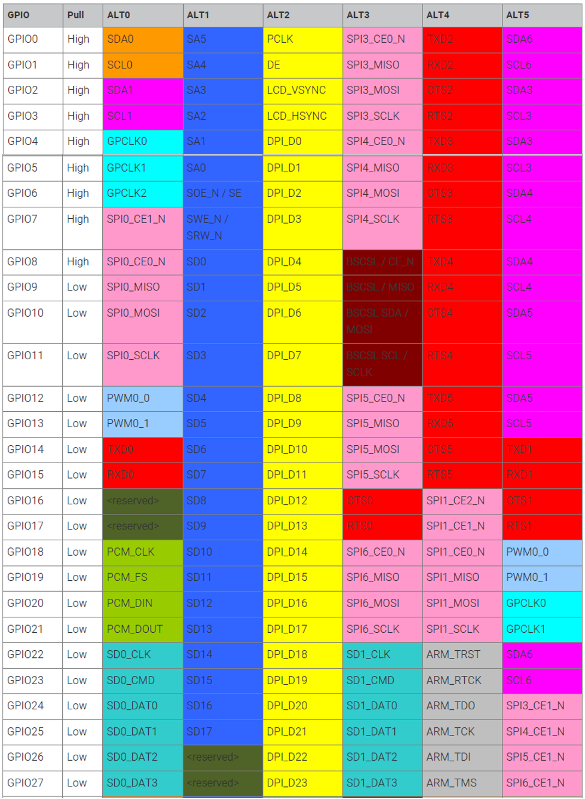

==============
GPIO Interface
==============
The BCM2711 has 54 general purpose input/output ports of which 28 are available on the Raspberry Pi module (``GPIO[27:0]``). When a GPIO port is used as an output, its  state can be toggled between logic 0 and logic 1 and a high-impedance state (tri-state). Since the GPIO ports are powered from a 3.3 V supply, the voltage levels are 0 V and 3.3 V respectively. When used as an input, the port can read these levels.

.. warning::
    The voltage applied to the GPIO pins **must not exceed 3.3 V**. When connected to circuits with higher output levels, appropriate levels shifters or resistive dividers must be used. 

There are special control registers which configure the GPIO ports to become an input or output port according to the required functionality. For many control tasks this simple so-called bit-banging IO interface is sufficient. For more complex tasks and data transfers requiring higher bandwidth, standardized serial protocols are available. To offload the CPU from implementing these protocols and to allow a precise protocol timing, special hardware blocks can be selected to be used with the GPIO ports. These blocks are enabled by selecting alternative function modes for a given GPIO pin. Every GPIO pin can carry an alternate function (up to 6) but not every alternate functions is available to a given pin as described in Table 6-31 in :download:`BCM2837-ARM-Peripherals.pdf <documents/BCM2837-ARM-Peripherals.pdf>`. Note that this documents actually describes the predecessor of the BCM2711 the BCM2835 (and not even the BCM2837, as the name suggests), which is used on the Raspberry Pi 1 modules. However, the given description of the GPIO port and other peripherals is still valid for the newer chip generations - apart from a few details like bus address offsets (see below).
Here is the description of a few  basic **GPIO Function Register** (see also chapter 6.1 in BCM2837-ARM-Peripherals document):

.. table:: **GPIO Function Select Register (GPFSEL0 @ 0x7E200000)**

    =====  ===========  ======================  ====  =======
    Bit    Field Name   Description             Type  Default
    =====  ===========  ======================  ====  =======
    31-30  ---          Reserved                R      0
    29-27  FSEL9        Function Select GPIO9   R/W    0
    26-24  FSEL8        Function Select GPIO8   R/W    0
    23-21  FSEL7        Function Select GPIO7   R/W    0
    20-18  FSEL6        Function Select GPIO6   R/W    0
    17-15  FSEL5        Function Select GPIO5   R/W    0
    14-12  FSEL4        Function Select GPIO4   R/W    0
    11-9   FSEL3        Function Select GPIO3   R/W    0
    8-6    FSEL2        Function Select GPIO2   R/W    0
    5-3    FSEL1        Function Select GPIO1   R/W    0
    2-0    FSEL0        Function Select GPIO0   R/W    0
    =====  ===========  ======================  ====  =======

The address space of the IO peripheral registers starts at 0x7E000000 of the VideoCore bus. There are six 32-bit registers of this type (GPFSEL0 - GPFSEL5) to cover all 54 GPIO pins. Each 3-bit word selects one out of eight function modes for a given GPIO pin:

.. table:: **GPIO Function Modes**

    ===== ===================
    FSELn Function
    ===== ===================
    000   Input
    001   Output
    100   Alternate function 0
    101   Alternate function 1
    110   Alternate function 2
    111   Alternate function 3
    011   Alternate function 4
    010   Alternate function 5
    ===== ===================

As default, all GPIO are configured as input pins after a reboot unless otherwise defined in any start-up configuration script. The level of any of the GPIO pins can be detected reading the **Pin Input Level Register**

.. table:: **GPIO Pin Input Level Registers (GPLEV0 @ 0x7E200034)**

    =====  ===========  ======================  ====  =======
    Bit    Field Name   Description             Type  Default
    =====  ===========  ======================  ====  =======
    31-0   LEVn         0 = pin n is low        R/W      0
                        1 = pin n is high
    =====  ===========  ======================  ====  =======

To use a GPIO pin as an output, the value 0x001 has to be written to its corresponding GPFSEL register. The output state is set by using the  **Pin Output Set/Clear Registers**:

.. table:: **GPIO Pin Output Set Registers (GPSET0 @ 0x7E20001C)**

    =====  ===========  ======================  ====  =======
    Bit    Field Name   Description             Type  Default
    =====  ===========  ======================  ====  =======
    31-0   SETn         1 = set pin to logic 1   R/W      0
    =====  ===========  ======================  ====  =======
 
.. table:: **GPIO Pin Output Clear Registers (GPCLR0 @ 0x7E200028)**

    =====  ===========  ======================  ====  =======
    Bit    Field Name   Description             Type  Default
    =====  ===========  ======================  ====  =======
    31-0   CLRn         1 = set pin to logic 0   R/W      0
    =====  ===========  ======================  ====  =======

Note that there are two registers of each LEV-, SET- and CLR-type (GPxxx0 and GPxxx1) to cover all 56 GPIO pins. Writing a 0 to one of the SET/CLR-registers has no effect. 

.. note::

    Having separate functions to set the logic levels to 1 and 0 respectively avoids the overhead of reading the current register before the actual modification and write-back. If only a single register for setting the output levels would be available a so-called read-modify-write operation has to be used. Here is an example which sets a register bit to 1 and back to 0 (pseudo code, assuming GPIO_OUTxxx allows access to the respective I/O register):

    .. code::

        temp     = GPIO_OUT     # read
        temp     = temp | 0x04  # modify (set bit 4 to one)
        GPIO_OUT = temp         # write
        temp     = temp & ~0x04 # modify (set bit 4 to zero)
        GPIO_OUT = temp         # write

    If separate registers for setting and clearing are available the following operation will be faster:

    .. code::

        GPIO_OUT_SET   = 0x04
        GPIO_OUT_CLEAR = 0x04

There are more GPIO configuration registers (documented and undocumented) which control additional features like pull-up/pull-down resistor for inputs, sensitivity for interrupt usage (level- or edge-sensitivity and its polarity), drive strength for outputs and more, which are beyond the scope of exercise. 

.. _gpio-programming-examples:

GPIO Programming Example
========================
This programming example describes the basic access to the GPIO registers. This register handling is made on "low level" (i.e. not using higher-level library functions calls) using C code. Here are samples from the ``GPIO.c`` file from ``examples/GPIO_Basics`` folder. This first code block takes care of the mapping the user accessible virtual memory to the physical memory of the register.

.. code-block:: c

  // start address of the I/O peripheral register space on the VideoCore bus
  #define BUS_REG_BASE    0x7E000000
  // start address of the I/O peripheral register space seen from the CPU bus
  #define PHYS_REG_BASE   0xFE000000 // RPi 4 
  // start address of the GPIO register space on the VideoCore bus
  #define GPIO_BASE       0x7E200000
  // address offsets for the individual registers
  #define GPIO_FSEL0      0x00  // mode selection
  #define GPIO_SET0       0x1C  // set outputs to '1'
  #define GPIO_CLR0       0x28  // set outputs to '0'
  #define GPIO_LEV0       0x34  // get input states
  
  // calculate the GPIO register physical address from the bus address
  uint32_t gpio_phys_addr = GPIO_BASE - BUS_REG_BASE + PHYS_REG_BASE;

  // get a handle to the physical memory space
  if ((int file_descriptor = open("/dev/mem", O_RDWR|O_SYNC|O_CLOEXEC)) < 0)

  // allocate virtual memory (one page size) and map the physical address to a pointer
  void *gpio_virt_addr_ptr = mmap(0, 0x1000, PROT_WRITE|PROT_READ, MAP_SHARED, file_descriptor, gpio_phys_addr);

Now ``gpio_virt_addr_ptr`` points to the start address of the GPIO register space. For access to the individual registers their specific address offsets are added:

.. code-block:: c

  // define memory pointer to access the specific registers
  uint32_t *gpfsel0 = (uint32_t*)((void *)gpio_virt_addr_ptr + GPIO_FSEL0);
  uint32_t *gpset0  = (uint32_t*)((void *)gpio_virt_addr_ptr + GPIO_SET0);
  uint32_t *gpclr0  = (uint32_t*)((void *)gpio_virt_addr_ptr + GPIO_CLR0);
  uint32_t *gplev0  = (uint32_t*)((void *)gpio_virt_addr_ptr + GPIO_LEV0);

Finally, the GPIO mode is set for a given pin which then can be used for output (or input) operations:

.. code-block:: c

  // Example: defining GPIO4 as output
  *gpfsel0 = 0x001 << (12); // output mode: FSEL[3:0] = 0x001, GPIO4 FSEL filed starts a bit 12
  // set output to '1'
  *gpset0 = 4
  // set output to '0'
  *gpclr0 = 4
  // read state from GPIO5
  state = 0x01 & (*gplev0 >> 5);

.. note::
  The function ``mmap("dev/mem/"...)`` returns a handle which allows unrestricted access to system wide memory and I/O ressources. Since this is a security sensitve access, it can only be executed with elevated access rights. Therefore, programs using that kind of functions have to be called as super user ``su ./<program_name>``.

Alternate GPIO Functions
========================
The GPIO ports can not only act a simple inputs or outputs but can be used to implement more complex I/O operations. A couple of industrial standard protocols are directly supported with dedicated hardware blocks. These alternate functions are configured and controlled via peripheral registers in a similar way like the basic input/output modes. However, these configurations settings a much more complex. Typically, a user will call functions from a library to set-up and use the alternate function modes. This table shows the available alternate functions which can be selected via the appropriate GPFSEL registers for each GPIO pin. Note that all alternate functions require a number of consecutive pins to be set to the same mode.

In the next section a few of commonly used serial protocols are described.

UART
----
The Universal-Asynchronous-Receiver-Transmitter (UART) protocol is widely used for communication between a pair of hardware components. It is a full-duplex, point-to-point transfer protocol which uses two separate data lines: one for sending data from host to device and the other for sending data from device to host. Unlike other serial protocols like I2C or SPI (see below) both devides can send data any time and there are no master and slaves roles. The data transmission is asynchronous as there is no additional clock signal needed to synchronize the transfer. To set-up a communication link via an UART bus, host and device have to use the same configuration settings for the data transfer engine. The UART controller on the Raspberry Pi supports:

  - Data rate (also called baud rate): Typically multiples of 9600 up to 115200 
  - Number of data bits: 8 (but also 5, 6 or 7 bits are supported)
  - Number of stop bits: 1 or 2
  - Parity: odd, even or none

Optional features for controlling the data transfer (handshaking), either using additional control lines or the transmission of special control characters are sometimes used but will be omitted here. 

Data are being sent always one byte at a time. A data transmission starts by sending a start bit (always 0), then the data bits LSB first, the parity bit (if configured) and finally the stop bit(s) which are always 1. A typical UART configuration is 8 data bits, even parity, one stop bit (8E1) and thus one data byte is transferred using 11 bit-clock cycles. This is a timing diagram of an UART transfer of one byte with a 8E1 setting. The period of one bit cycle is 1/F_baud.

.. figure:: images/UART.png
    :width: 600
    :align: center

The encoding and decoding of the parity bit is done in the UART hardware. If even (odd) parity is selected the transmitter will set the parity to a logic value such the sum off all data bytes including the parity bit is even (odd). The checking of the validity of a received byte is transparent to the user. A mismatch of calculated and received parity will be notified to the user as a receive error.

.. note::
    The signal names RX and TX, which are commonly used for labeling the UART bus, can cause confusion when connecting one device with another. Since a device sends data via its TX port and expects to receive data via its RX port, at some point the TX labeled net from one device needs to be connected to the RX labeled net of the other device and vice versa.

In the GPIO alternate modes table, the UART signals are marked in red with the names ``TXDn`` and ``RXDn``. The UART port is available on ``GPIO14`` (TX) and ``GPIO15`` (RX) when mode 0 or 5 is selected. Additional signals for hardware handshaking (``CTS1`` and ``RTS1``) are available on ``GPIO16`` and ``GPIO17`` when mode 5 is used.

I2C
---

SPI
---

PWM
---

SMI
---

