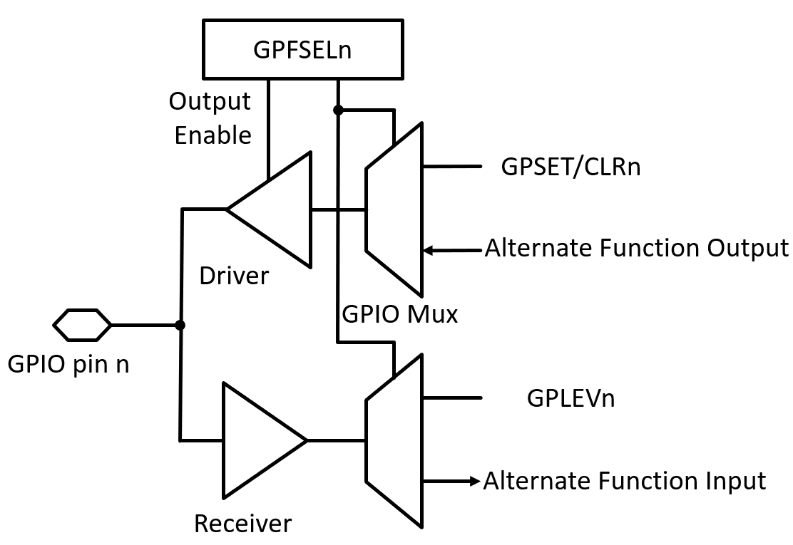
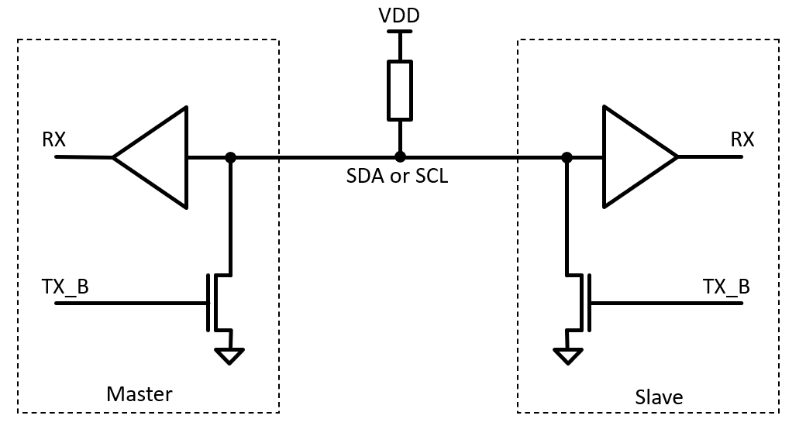

.. _gpio-interface:

==============
GPIO Interface
==============
The BCM2711 has 54 general purpose input/output ports of which 28 are available on the Raspberry Pi module (``GPIO[27:0]``). When a GPIO port is used as an output, its  state can be toggled between logic 0 and logic 1 and a high-impedance state (tri-state). Since the GPIO ports are powered from a 3.3 V supply, the voltage levels are 0 V and 3.3 V respectively. When used as an input, the port can read these levels. Here is a simplified function diagram of a GPIO block showing the main control registers which are explained below. There are additional registers for interrupt modes, pull-up and pull-down configuration, drive strength and others, which are not shown in this diagram.

    GPIO block function diagram showing the main registers

.. danger::
    The voltage applied to the GPIO pins **must not exceed 3.3 V**. When connected to circuits with higher output levels, appropriate levels shifters or resistive dividers must be used. 

There are control registers which configure the GPIO ports to become an input or output port according to the required functionality. For simple control tasks this basic I/O function is sufficient. For more complex tasks and data transfers requiring higher bandwidth, standardized serial protocols are used. To offload the CPU from implementing these protocols and to allow a precise (i.e. hardware controlled) timing, special hardware blocks are available in the I/P periphery to be used with the GPIO ports. These blocks are enabled by selecting alternative function modes for a given GPIO pin. Every GPIO pin can carry an alternate function (up to 6) but not every alternate functions is available to a given pin as described in Table 6-31 in :download:`BCM2837-ARM-Peripherals.pdf <documents/BCM2837-ARM-Peripherals.pdf>`. Note that this documents actually describes the predecessor of the BCM2711 the BCM2835 (and not even the BCM2837, as the name suggests), which is used on the Raspberry Pi 1 modules. However, the description of the GPIO port and other peripherals is still valid for the newer chip generations - apart from a few details like bus address offsets (see below).
Here is the description of the basic **GPIO Function Register** (see also chapter 6.1 in BCM2837-ARM-Peripherals document):

.. table:: **GPIO Function Select Register (GPFSEL0 @ 0x7E200000)**

    =====  ===========  ======================  ====  =======
    Bit    Field Name   Description             Type  Default
    =====  ===========  ======================  ====  =======
    31-30  ---          Reserved                R      0
    29-27  FSEL9        Function Select GPIO9   R/W    0
    26-24  FSEL8        Function Select GPIO8   R/W    0
    23-21  FSEL7        Function Select GPIO7   R/W    0
    20-18  FSEL6        Function Select GPIO6   R/W    0
    17-15  FSEL5        Function Select GPIO5   R/W    0
    14-12  FSEL4        Function Select GPIO4   R/W    0
    11-9   FSEL3        Function Select GPIO3   R/W    0
    8-6    FSEL2        Function Select GPIO2   R/W    0
    5-3    FSEL1        Function Select GPIO1   R/W    0
    2-0    FSEL0        Function Select GPIO0   R/W    0
    =====  ===========  ======================  ====  =======

The address space of the IO peripheral registers starts at 0x7E000000 of the VideoCore bus. There are six 32-bit registers of this type (GPFSEL0 - GPFSEL5) to cover all 54 GPIO pins. Each 3-bit word selects one out of eight function modes for a given GPIO pin:

.. table:: **GPIO Function Modes**

    ===== ===================
    FSELn Function
    ===== ===================
    000   Input
    001   Output
    100   Alternate function 0
    101   Alternate function 1
    110   Alternate function 2
    111   Alternate function 3
    011   Alternate function 4
    010   Alternate function 5
    ===== ===================

As default, all GPIO are configured as input pins after a reboot unless otherwise defined in any start-up configuration script. The level of any of the GPIO pins can be detected reading the **Pin Input Level Register**

.. table:: **GPIO Pin Input Level Registers (GPLEV0 @ 0x7E200034)**

    =====  ===========  ======================  ====  =======
    Bit    Field Name   Description             Type  Default
    =====  ===========  ======================  ====  =======
    31-0   LEVn         0 = pin n is low        R/W      0
                        1 = pin n is high
    =====  ===========  ======================  ====  =======

To use a GPIO pin as an output, the value 0x001 has to be written to its corresponding GPFSEL register. The output state is set by using the  **Pin Output Set/Clear Registers**:

.. table:: **GPIO Pin Output Set Registers (GPSET0 @ 0x7E20001C)**

    =====  ===========  ======================  ====  =======
    Bit    Field Name   Description             Type  Default
    =====  ===========  ======================  ====  =======
    31-0   SETn         1 = set pin to logic 1   R/W      0
    =====  ===========  ======================  ====  =======
 
.. table:: **GPIO Pin Output Clear Registers (GPCLR0 @ 0x7E200028)**

    =====  ===========  ======================  ====  =======
    Bit    Field Name   Description             Type  Default
    =====  ===========  ======================  ====  =======
    31-0   CLRn         1 = set pin to logic 0   R/W      0
    =====  ===========  ======================  ====  =======

Note that there are two registers of each LEV-, SET- and CLR-type (GPxxx0 and GPxxx1) to cover all 56 GPIO pins. Writing a 0 to one of the SET/CLR-registers has no effect. 

.. note::

    Having separate functions to set the logic levels to 1 and 0 respectively avoids the overhead of reading the current register before the actual modification and write-back. If only a single register for setting the output levels would be available a so-called read-modify-write operation has to be used. Here is an example which sets a register bit to 1 and back to 0 (pseudo code, assuming GPIO_OUTxxx allows access to the respective I/O register):

    .. code::

        temp     = GPIO_OUT     # read
        temp     = temp | 0x04  # modify (set bit 4 to one)
        GPIO_OUT = temp         # write
        temp     = temp & ~0x04 # modify (set bit 4 to zero)
        GPIO_OUT = temp         # write

    If separate registers for setting and clearing are available the following operation will be faster:

    .. code::

        GPIO_OUT_SET   = 0x04
        GPIO_OUT_CLEAR = 0x04

There are more GPIO configuration registers (documented and undocumented) which control additional features like pull-up/pull-down resistor for inputs, sensitivity for interrupt usage (level- or edge-sensitivity and its polarity), drive strength for outputs and more, which are beyond the scope of exercise. 

Alternate GPIO Functions
========================
The GPIO ports can not only act a simple inputs or outputs but can be used to implement more complex I/O operations. A couple of industrial standard protocols are directly supported with dedicated hardware blocks. These alternate functions are configured and controlled via peripheral registers in a similar way like the basic input/output modes. However, these configurations settings a much more complex. Typically, a user will call functions from a library to set-up and use the alternate function modes. This table shows the available alternate functions which can be selected via the appropriate GPFSEL registers for each GPIO pin. Note that all alternate functions require a number of consecutive pins to be set to the same mode.

.. figure:: images/GPIO_Alt.png
    :width: 600
    :align: center

In the next section a few of commonly used serial protocols are described.

UART
----
The Universal-Asynchronous-Receiver-Transmitter (UART) is a widely used communication protocol. It is a full-duplex, point-to-point protocol which uses two data lines: one for sending data from host to device and the other for sending data from device to host. Unlike other serial protocols like I2C or SPI (see below) both devices can send data any time and there are no master and slaves roles. 

The data transmission is asynchronous as there is no additional clock signal involved to synchronize the transfer. To set-up a communication link via an UART interface, host and device have to use the same configuration settings for the data transfer engine. The UART controller on the Raspberry Pi supports:

  - Data rate (also called baud rate): Typically multiples of 9600 up to 115200 
  - Number of data bits: 8 (but also 5, 6 or 7 bits are supported)
  - Parity: odd, even or none
  - Number of stop bits: 1 or 2

The parity (if selected as odd or even) adds an additional bit to the end of the data transfer (before the stop bit) which value is chosen such that the total number of logic ones in the transfer (data bits plus parity bit) is even (or odd as specified in the protocol configuration). The receiver can use the parity bit to check the integrity of the data received. 

Optional features for controlling the data transfer (handshaking), either using additional control lines or the transmission of special control characters are sometimes used but will be omitted here. 

Data are being sent always one byte at a time. A data transmission starts by sending a start bit (always 0), then the data bits LSB first, the parity bit (if configured) and finally the stop bit(s) which are always 1. The period of one bit cycle is 1/F_baud.

    
    Timing diagram of an UART transfer of one byte (0xcd): one start bit, 8 data bits, even parity, and one stop bit (8E1).

The encoding and decoding of the parity bit is done in the UART hardware. If even (odd) parity is selected the transmitter will set the parity to a logic value such the sum off all data bytes including the parity bit is even (odd). The checking of the validity of a received byte is transparent to the user. A mismatch of calculated and received parity will be notified to the user as a receive error. However, multiple (odd) bit errors can not be detected.

.. note::
    The signal names RX and TX, which are commonly used for labeling the UART bus, can cause confusion when connecting one device with another. Since a device sends data via its TX port and expects to receive data via its RX port, at some point the TX labeled net from one device needs to be connected to the RX labeled net of the other device and vice versa.

In the GPIO alternate modes table, the UART signals are marked in red with the names ``TXDn`` and ``RXDn``. The UART port is available on ``GPIO14`` (TX) and ``GPIO15`` (RX) when mode 0 or 5 is selected. Additional signals for hardware handshaking (``CTS1`` and ``RTS1``) are available on ``GPIO16`` and ``GPIO17`` when mode 5 is used.

I2C
---
The Inter-Integrated-Circuit (I2C) bus is a synchronous two-wire serial interface which can transfer data between a master and multiple slaves. It uses bidirectional data (**SDA**) and clock (**SCL**) lines to transfer the data. The clock line is usually driven by the host while the data line will be controlled by the host or the device depending on the transfer direction. There are extensions to this standard functionality (multiple masters, clock stretching) which are not covered here. The data rate is typically 100 kHz with options for faster modes like 400 kHz and 1 MHz. 

The SDA and SCL line drivers are implemented as so-called open-drain buffers. These buffers can drive the line only to a low state. The high state is generated with an external pull-up resistor which is mandatory for both SDA and SCL lines. This configuration avoids bus conflicts which would arise when a line would be actively driven high and low at the same time. This imposes a practical limit on the data rate because of the inherent RC time constant given by the value of the pull-up resistor (typically in the range of 1 kOhm to 10 kOhm) and the parasitic capacitance of the bus (max. 400 pF).

    
    Implementation of SDA/SCL driver and receiver. The open drain outputs (driven by the inverted output signal TX_B) avoid potential bus conflicts when master and one or more slaves try to drive the SDA line with different logic levels.

A I2C transmission is initiated by the master sending a **START** condition (falling edge on the SDA line while SCL level is HIGH) which initializes the I2C interfaces of the devices on the bus. Similar to the start condition, a **STOP** condition is send after the communication has finished (rising edge on the SDA line while SCL level is HIGH).

Each transfer consists of one ore more bytes. Each byte is send MSB first and the data on the SDA line must be valid during the high phase of the SCL clock. A change of the data line state during the high phase of the clock would be interpreted as a **START** or **STOP** condition (see above). After eight clock cycles for sending the data, a ninth clock cycle is used to let the receiver respond to the reception of the transferred byte: The receiver will hold the SDA low during the ninth SCL period to indicate an acknowledgement (**ACK**). In case the receiver detected an error during the last transmission it will generate a not-acknowledge (**NACK)** by letting the SDA line go high.

For writing data from host to a device, the address of the selected device is sent first followed by one ore more data bytes. When the host wants to read data from a device, the host first sends the device address with the R/W bit (LSB of the address) set to one. Then the host releases the data line and the selected device sends the requested data. 

    
    I2C bus activity during a address transfer: **START** condition, address byte, **ACK** bit (driven by receiver), and **STOP** condition. 

The I2C protocol is often used for distributing non timing-critical configuration data form a central host (CPU or MCU) to a number of peripheral chips on a PCB. But also for exchanging configuration and status data across components, for example between a graphics adapter and monitor connected via DisplayPort or HDMI cable (resolution, content protection encryption keys), or a battery pack and system controller of a notebook or an e-bike. In this lab course an I2C bus is used for communicating with the SMU module where it connects to the ADC and the DAC chips.

In the GPIO alternate modes table, there are two I2C buses available, both in ALT mode 0: ``SDA0`` and ``SCL0`` on ``GPIO0`` and ``GPIO1``, and ``SDA1`` and ``SCL1`` on ``GPIO2`` and ``GPIO3``, respectively. While ``SDA0`` and ``SCL0`` are used for internal communication (HAT), the I2C bus 1 on ``GPIO2`` and ``GPIO3`` is made available on the carrier board.

SPI
-----

The Serial Peripheral Interface (SPI) is a synchronous bus which typically uses four wires: 
  - MOSI, data line from master to slave (master out, slave in)
  - MISO, data line form slave to master (master in, slave out)
  - SCLK, clock line from master to slave(s)
  - CS_B, chip select line (active low, one per slave)

An SPI can connect to multiple devices in parallel. To avoid conflicts on the shared MISO line, only one device at a time is allowed to send data while all others have to keep their MISO output buffer in a high impedance state. To accomplish this, each device on a SPI bus has to connect to an individual CS_B line which controls the transfer and the activation of the output buffer. Another configuration is the series connection of devices where the MOSI output of one device connects to the MISO input of the next device in the chain while all other lines are shared (including the CS_B line).

    SPI bus with two slave devices connected in series.

A transfer on the SPI bus is initiated by the master pulling the CS_B line of the selected slave low. This enables the shift register of the receiver and the output buffer of the MOSI line gets activated. The master shifts the data over the MOSI pad synchronous to the SCLK signal into the slave. On each rising edge of the SCLK new data of the MOSI line is registered in the slave while its MISO line clocks out the data as requested by the previous transfer. When the transfer is finished the CS_B line is pulled high which disables the MISO output buffer and transfers the data from the device shift register into the associated data latches. The length of the transfer and data word alignment (MSB or LSB first) depends on the device specification.

    
    Transfer of 10 bits between master and slave. While data from the master D[9:0] is shifted into the slave, the slave puts out data R[9:0] to the master.

    Functional block diagram of an SPI device interface. During an write access to the device the active low CS_B line enables shift register and output buffer. When the CS_B line goes high the shift register data is transferred to the data latch. Additional logic (not shown) allows data from the latch (or other selected registers) to be loaded back into the shift register for reading. 

An SPI bus is used for the communication with most of the modules in this lab course. Using ALT mode 0 for GPIO[11:8] enables the bus.

.. table:: **Summary of the GPIO ALT modes for implementing serial interface protocols**

    =====  ===========  ==========  ========
    GPIO    ALT mode    Bus type    Function
    =====  ===========  =========   ========  
      2       0            I2C        SDA  
      3       0            I2C        SCL  
      8       0            SPI        CS_B  
      9       0            SPI        MISO  
     10       0            SPI        MOSI  
     11       0            SPI        SCLK  
     14       0            UART       TX  
     15       0            UART       RX  
    =====  ===========  =========   ========  

PWM
---

SMI
---

