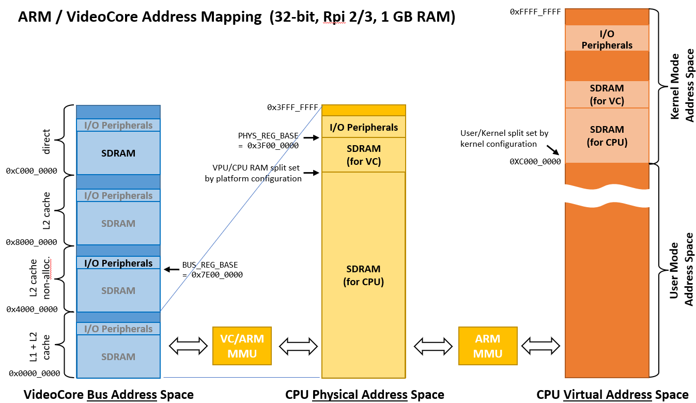

========================
Embedded System Hardware
========================
This chapter introduces the computing hardware which is used in all experiments. Although the specific details of the following description relate to the Raspberry Pi platform, the fundamental aspects of interaction between software, system hardware and external devices are platform independent. The first section describes the Raspberry Pi hardware with a focus on the access to the General Purpose Input/Output (GPIO) ports. The second section gives an overview of commonly used serial protocols for communication between systems and electronic components. Finally, programming examples are presented and simple tasks which introduce the first experiment (GPIO Programming) are shown.

Computing Platform
==================
The central part of a Raspberry Pi module is a system-on-chip (SOC). A SOC integrates the CPU with peripheral components like display controller, various communication interfaces (USB, Ethernet, PCIe, etc.), memory controller, power regulators and others on a single chip. Therefore, only a few external components are needed to build a complete computing system. The picture belows shows the Raspberry Pi 4B module with the central SOC, the SDRAM (Synchronous dynamic random-access memory) memory, an on-board Wi-Fi & Bluetooth transceiver, support chips for Ethernet and USB, connectors for video, audio, USB and a header for the GPIO ports.

.. figure:: images/RPI4.png
    :width: 600
    :align: center

    Raspberry Pi 4B module

The following is a block diagram of the BCM2711 chip; the specific SOC used in Raspberry Pi 4 modules. The main function blocks include a multi-core ARM CPU, a low power video processor called VideoCore (sometimes also referred to as graphics- or video-processing-unit, GPU or VPU), and a host of peripherals including the GPIO interface (in the lower right corner). All the blocks communicate and exchange data via an internal system bus (AMBA/AXI bus). 

.. figure:: images/BCM2711.png
    :width: 600
    :align: center

    Block diagram of the BCM2711 SOC used on the Raspberry Pi 4B

Memory and I/O Access
=====================
The operating system and the user programs run on a quad-core CPU (ARM Cortex A-72) while graphics/video data processing is handled by VideoCore VPU. Both the CPU and the VPU share the same system memory and peripheral I/O blocks attached to the system bus. The address translation between system bus, CPU, and user and kernel program space is done by so-called memory management units (MMU). One MMU manages the resource sharing between CPU and VPU (VC/ARM MMU) while the other MMU (ARM MMU) maps memory and I/O peripherals to virtual user- and kernel-address space. The following block diagram shows the relations between the different address spaces (see also section 1.2 in :download:`BCM2837-ARM-Peripherals.pdf <documents/BCM2837-ARM-Peripherals.pdf>`):

    Address maps for system bus (left), CPU (center) and virtual memory spaces (right)

The center column shows the address space as seen by the CPU, also called **physical address** space. The system memory (implemented as synchronous random access memory, SDRAM) starts at address ``0x00000000`` and occupies a range according to the amount of memory available on the module (1 GB, 2 GB, 4 GB, or 8 GB). The I/O peripherals registers start at the address offset ``PHYS_REG_BASE`` which depends on the SOC version and memory size (see table below). 

The actual access to memory or I/O resources is managed via the VPU MMU which controls the system bus. In the left column the system **bus address** space of the VPU is shown. The VPU address space is larger than the physical address space which enables so-called aliasing. That means that depending on the two additional address bits, different access modes for the same physical address can be used. Depending on the chosen alias offset, the access is cached (L1 + L2, or L2 coherent or L2 only) or direct. Access to I/O peripherals always is done via coherent, non-allocating L2 Cache (address offset = 0x40000000 -> ``BUS_REG_BASE = 0x7E000000``). 

A multi-tasking operating system, which is typically run on a computing system, cannot allow user code to direct access to the physical address space, since concurrent access from different tasks to the same resource would compromise data integrity and security. Therefore, user code must use **virtual addresses**, which are mapped by the CPU MMU to the physical address space. This allows parallel running user (and kernel) task to access shared resources in an orderly way. The structure of this virtual address space is shown in the right column.

.. note:: It is not possible to directly access I/O registers or memory locations. To use I/O or memory resources, a user accessible **virtual address** has to be mapped to the **physical addresses**. Since the register addresses values referenced in the BCM2837-ARM-Peripherals document are referring to the system **bus address** space handled by the VideoCore, the resulting address offsets as seen by the CPU have to be calculated. 

A generic procedure to access peripheral resources looks like this: At first the address at which the CPU can access the IO periphery register is calculated. This step converts the address at which the peripheral register is located on the VideoCore bus to the physical address the CPU can access. Than a user accessible virtual memory location has to be allocated and mapped to the physical address of the I/O resource. This is the pseudo code of such operation:

.. code::
    
    reg_physical_address = reg_bus_address - BUS_REG_BASE + PHYS_REG_BASE
    virt_reg_address = mmap(reg_physical_address)

    
The ``BUS_REG_BASE`` address offset of the VideoCore bus is ``0x7E000000`` for all models, while the ``PHYS_REG_BASE`` offset depends on the specific chip implementation. This is important for the code portability between different Raspberry Pi platforms, which have specific address offset values:

.. table::
    
    ===========  ==========  ==============  ====
     Model        Chip        PHYS_REG_BASE  RAM
    ===========  ==========  ==============  ====
      RPi 1       BCM2835     0x20000000     0.5 GB
      RPi 2       BCM2836     0x3F000000     1 GB
      RPi 3       BCM2837     0x3F000000     1 GB
      RPi 4       BCM2711     0xFE000000     1, 2, 4, or 8 GB      
    ===========  ==========  ==============  ====

An implementation of an access to the GPIO registers will be shown in the section :ref:`gpio-programming-examples`.

Further reading
---------------
- `BCM2835 ARM Peripherals <https://www.raspberrypi.org/app/uploads/2012/02/BCM2835-ARM-Peripherals.pdf>`_
- `BCM2835 data sheet errata <https://elinux.org/BCM2835_datasheet_errata>`_
- `Raspberry Pi DMA programming in C <https://iosoft.blog/2020/05/25/raspberry-pi-dma-programming/>`_

