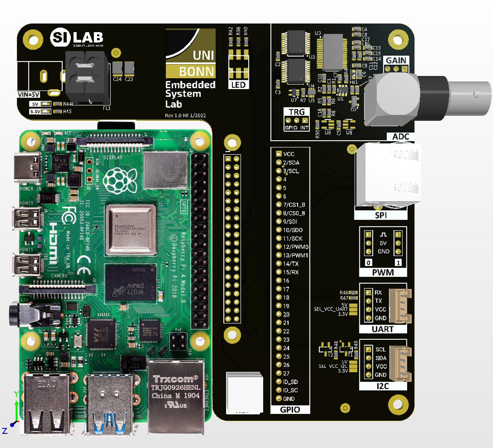
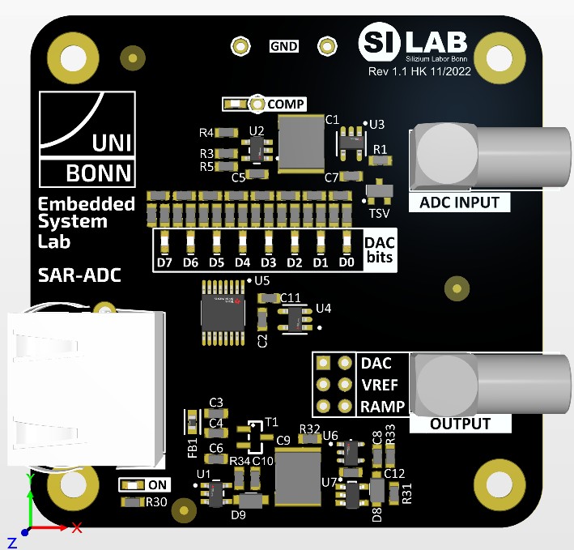
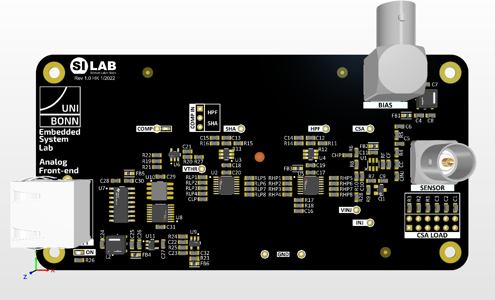
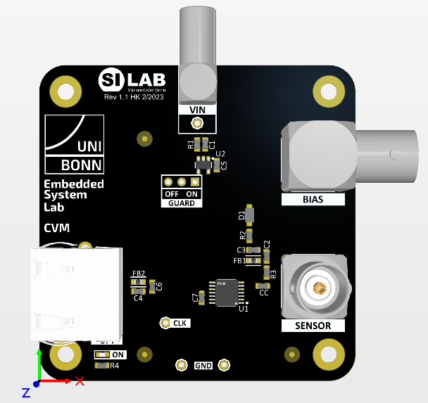

============
Introduction 
============

This modular lab course gives an introduction to selected aspects of analog signal processing and data acquisition techniques. An embedded system running user programs written in Python and/or C is used to directly interact with the experiment module's hardware . The embedded system hardware is based on a Raspberry Pi single board computer which is mounted to a custom base board. The base board allows access to various interfaces (UART, I2C, SPI etc.) which are implemented via the general purpose IO ports (GPIO). In addition, the base board features a fast 12-bit ADC, which allows the Raspberry Pi to be used as a simple oscilloscope to sample waveforms for further processing, documentation, and analysis.

    Embedded System Lab base board with a Raspberry 4 module

The individual experiments are featuring dedicated add-on boards (modules) which are controlled from the Raspberry Pi via an SPI bus and other GPIO signals. The fast ADC on the base board will be used to record analog waveforms and also other lab equipment like power supplies can be remotely controlled with the Raspberry Pi. Here is overview of currently available add-on modules/experiments:  

SAR ADC
-------------------------------------
This module implements a 8-bit Successive-Approximation-Register ADC (SAR ADC) which consists of a sample and hold input stage, a comparator, and an 8-bit DAC. The user will write the code to implement the SAR logic which controls sampling stage and DAC and develop scripts for automated measurements to characterize the ADC's various performance parameters (linearity, noise, etc.).

    Successive-Approximation-Register ADC Module

Analog Front-end 
----------------
In this experiment a typical analog signal processing chain for semiconductor detectors will be introduced and analyzed. The user will measure the system response to calibration signals and measure the electronic noise as a function of various sensor and circuit parameters. Advanced users can build a Multichannel-Spectrum-Analyzer (MCA) with this module to measure the energy spectrum of radioactive sources.

    Analog Front-end Module

Capacitance Measurement
-----------------------
The capacitance of a semiconductor detector is an important parameter for the sensor performance. This module measures the capacitance of a sensor diode as a function of the applied bias voltage (CV measurement). In this experiment the user will  developed scripts to control the capacitance measurement circuit, read the analog measurement value, and remote-control a power supply for the detector bias.

    CV-Meter Module

Fast Pulse Sampler
------------------
High-speed signals need controlled impedance lines (transmission lines, TML) to maintain their signal integrity. So called time-domain-reflectometry (TDR) is a known method to characterize TMLs. This module implements a TDR measurement circuit which generates a very fast pulse to be coupled to a TML-under-test. The reflected waveform is recorded with digital serial analyzer (DSA) which will be controlled by the user code. 

.. figure:: images/psa.png
    :width: 300
    :align: center

    Fast Pulse Sampler

In the course of each experiment, the user will:

- Develop scripts to control the given module, 
- Acquire various measurement data and
- Document and analyze the measurements.

Each experiment comes with basic code examples which can (but don't have to) be used to get started. The example code is mainly written in Python but C examples are also given in some places. The experiments can be done in arbitrary sequence but is is recommended to start with the GPIO Basics tutorial.