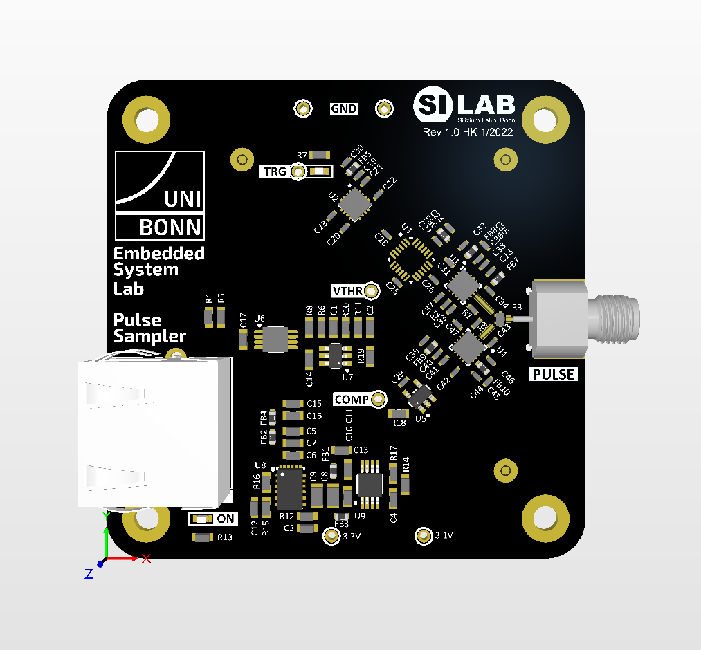

=====================================
Experiment: Time Domain Reflectometry
=====================================

    Pulse sampler module for TDR measurements

Time Domain Reflectometry
-------------------------
This experiment is designed to introduce the student to the concept of Time Domain Reflectometry (TDR) and its applications in the field of electrical engineering. TDR measurements are primarily used to determine the impedance of a transmission line, the location of faults in cables, and the characteristics of interconnects. The measurement method is based on sending a fast rise-time step pulse along the transmission line and analyzing the amplitude of the reflected waveform to determine the impedance of the line and to locate potential discontinuities. A simplified block diagram of a TDR system is shown below:

.. figure:: images/TDR.png
    :width: 500
    :align: center

    Functional block diagram of the TDR module. The full circuit schematic is found here: :download:`TDR_1.1.pdf <documents/TDR_1.1.pdf>`

The challenge in high resolution TDR measurements is the high bandwidth requirement for the test pulse generation and fast timing of the analog-to-digital conversion of the reflected pulse. For example a signal on a typical PCB traces has a propagation delay of about 10 ps per mm. To measure a transmission line with a spatial resolution of 3 mm the rise time of the test pulse and the analog-to-digital conversion time must be in the order of 30 ps. While modern circuit technology allows for fast rise-time pulses to be generated, the analog-to-digital conversion at that speed is still a challenge. Therefore the principle of a digital serial analyzer is used in this experiment (and also in many commercial TDR devices): Instead of sampling the reflected amplitude of a single pulse in one go, the pulse is repeated many times and only one point of the received pulse is sampled at a time. By shifting the sampling point in small time steps with respect to the generated output pulse, the reflected waveform is acquired point by point. This method reduces the ADC sampling speed requirement to the repetition rate of the generated pulse, which is typically in the order of 10 - 100 kHz.

Circuit Implementation
----------------------

The circuit uses a fast driver to convert the **TRG** input into a fast rise-time step pulse at the node **VTX** (:math:`\tau_{rise} \approx 35 ps`). The pulse is then transmitted along the the device-under-test (cable or circuit traces) connected to the SMA connector **PULSE**. Also connected to the output node is a latched comparator that receives the reflected pulse **VRX**. A so called pulse splitter between the nodes **VTX**, **PULSE**, and **VRX** ensures that no reflections are induced by the measurement setup itself (i.e. the impedance looking into each of the three nodes is 50 Ohm. The latched comparator compares the amplitude **VRX** with a programmable threshold **VTHR** in the moment when the clock input of the latch sees a rising edge. Since the latch signal is generated from a delayed version of the **TRG** input, scanning the delay allows the received signal reflection to be measured at different points in time which is equivalent to different positions along the transmission line. The analog-to-digital conversion is using the successive-approximation-register (SAR) method: For a fixed delay setting, the SAR logic implemented in the control script scans the threshold **VTHR** by adjusting a 10-bit DAC to find the closest value equivalent to the received amplitude **VRX**. By measuring the amplitude at each delay setting (1024 delay steps, 5 ps step size), the waveform of the reflected signal is reconstructed.

Control Script
--------------

The control script for the TDR module is based upon a loop to control the successive analog to digital conversion (similar to the SAR-ADC experiment). An outer loop shifts the delay setting to scan the received signal reflection along the time domain. Pseudo code would look like this:

.. code-block:: c

  // Outer loop: Update SPI register for a new delay value
  setDelay(delay++)
  
    // Inner loop: Repeat code block below n-times while j runs from n-1 to 0.
    TRG = 1 //   Trigger the output pulse         
    
    // SAR logic
    DAC_register += (1 << j)   // set and test DAC register bits from MSB to LSB
    if (!COMP)                 // read the result of the comparator)
      DAC_register -= (1 << j) // DAC output larger then VIN, subtract current DAC register bit
    
    // The final DAC register value after n-iterations is the digital representation of the analog input voltage.
    waveform[delay] = DAC_register
    TRG = 0 // reset the trigger signal

Exercises 
---------

There is a script ``tdr.py`` in the folder ``code\TDR`` which contains the necessary includes and the basic configuration for the SPI interface and the two GPIO signals. Copy it into your ``work`` folder and use it as a template for your scripts. There is also another file called ``tdr_solution.py`` which contains working code for most of the exercises. Note that this should only be used for reference or as a last resort if you got stuck.

The exercise 0 contains preparatory questions that should be answered before coming to the lab.

.. admonition:: Exercise 0. Preparatory questions

  #. Explain the term reflection coefficient in the context of transmission lines. How is it defined? How can the refection coefficient be calculated from the transmission line impedance :math:`Z_0` and the load impedance :math:`Z_L`?
  #. What is the maximum cable or trace length that can be measured with the TDR module? Assume that the maximum delay setting is 5 ns and the propagation delay of the cable is 5 ns/m.
  #. Assume you have a signal generator with 50 Ohm output impedance producing a positive edge with 100 mV amplitude and a 20 cm coaxial cable (50 Ohm characteristic impedance, 5 ns/m propagation delay) connected to it. Sketch the waveforms at the generator output for the following cases (x-axis: time, y-axis: voltage):

     * The cable is not terminated (open end).
     * Termination with a 100 Ohm resistor.
    
     What are the reflection coefficients for both cases?

  #. The TDR module makes use of a pulse splitter (three resistor is a star-configuration, see circuit block diagram above) to join three signal paths together. Calculate the required resistor values to ensure that the impedance looking into each of the three nodes is 50 Ohm. Assume that the  impedance connected to each of the pulse splitter nodes is also 50 Ohm. 
  #. How is the signal amplitude affected by the pulse splitter (i.e. what is the signal attenuation from **VTX** to **VPULSE**)? 
  #. The received signal at **VRX** is composed of the superstition of the incident wave from the pulse generator :math:`V_{inc}` and the reflected wave :math:`V_{ref}` coming back from the transmission line. Calculate the attenuation factors as seen from **VRX** node for both the incident and reflected wave as they are combined by the pulse splitter. Hint: Keep in mind that any reflected signal will have passed the pulse spitter two times (forward wave **VTX** to **VPULSE** and reflected wave **VPULSE** to **VRX**).
  #. Redraw the waveform sketch from the first question, now including the effect of the pulse splitter attenuation.

.. admonition:: Exercise 1. Implementing the control script and data representation

  #. Start with the implement the successive-approximation-register (SAR) logic. Test your code by use the 10-bit DAC to measure the static voltage at the **VRX** node. For this test, leave the TDR output unconnected and set the delay to the maximum value. Depending of the logic state of the **TRG** signal, the voltage at **VRX** will be approx. 2.8 V or 3.0 V, respectively.
  #. Add an outer loop to your code that scans the delay setting thru its entire range to sample the received signal reflection along the time domain. Plot the raw data (time, voltage) and observe the waveform for different cables and terminations connected to the TDR module.
  #. Now calibrate the measurement by converting the voltage values to reflection coefficients. Connect a short SMA stub (or cable) as a 50 Ohm reference and leave it open. The part of the wave before the reflection at the open end will identify the corresponding sampled voltage data points as the 50 Ohm reference with a reflection coefficient of 0. The part of the wave after the reflection at the open end corresponds to a reflection coefficient of 1. Use this information to calibrate the voltage values to reflection coefficients. 
  #. In a next step extend the calibration from reflection coefficient to impedance. Use the formula derived in exercise 0.
  #. Finally, convert the time data to distance by using the typical propagation delay of the cable. Hint: The reflected wave travels twice the distance of the incident wave. 