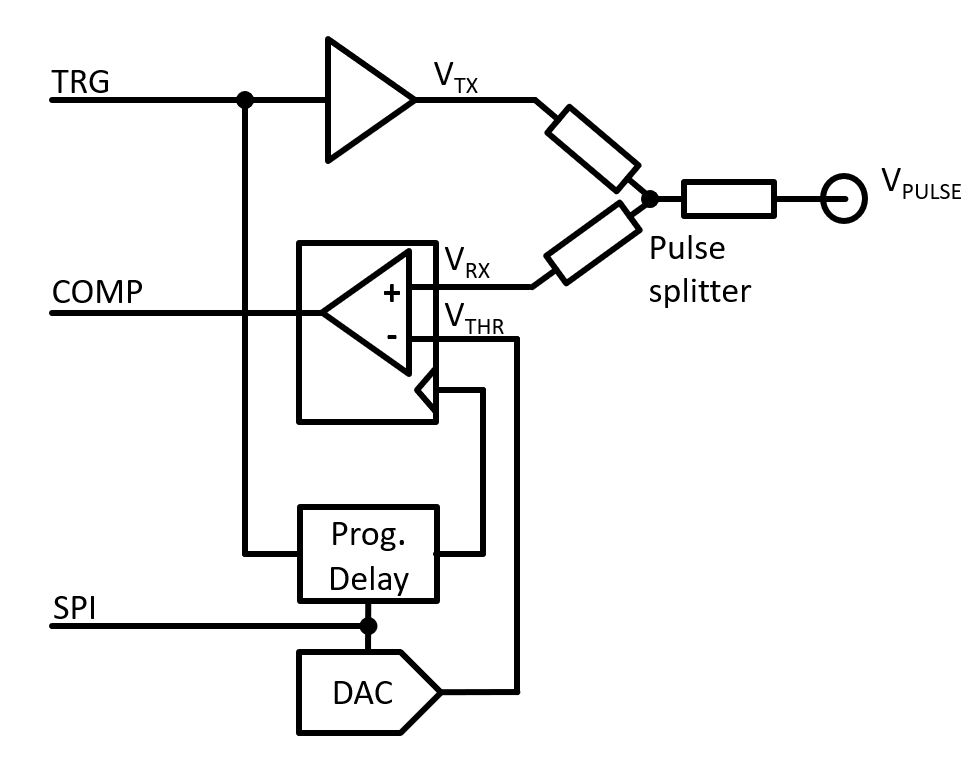

=====================================
Experiment: Time Domain Reflectometry
=====================================

.. figure:: images/psa.png
    :width: 300
    :align: center

    Pulse sampler module for TDR measurements

Time Domain Reflectometry
-------------------------
This experiment is designed to introduce the student to the concept of Time Domain Reflectometry (TDR) and its applications in the field of electrical engineering. TDR measurements are primarily used to determine the impedance of a transmission line, the location of faults in cables, and the characteristics of interconnects. The measurement method is based on sending a fast rise-time pulse along the transmission line and analyzing the amplitude of thr reflected pulse to determine the impedance of the line. A simplified block diagram of a TDR system is shown below:

    Functional block diagram of the TDR module. The full circuit schematic is found here: :download:`TDR_1.1.pdf <documents/TDR_1.1.pdf>`

The challenge in high resolution TDR measurements is the high bandwidth requirement for the test pulse generation and the analog-to-digital conversion of the received pulse reflection. For example a signal on a typical PCB traces has a propagation speed of about 0.1 mm/ps. To measure a transmission line with a spatial resolution of 3 mm the rise time of the test pulse and the analog-to-digital conversion time must be in the order of 30 ps. While modern circuit technology allows for fast rise-time pulses to be generated, the analog-to-digital conversion at that speed is still a challenge. Therefore the principle of a digital serial analyzer is used in this experiment (and also in many commercial TDR devices): Instead of sampling the reflected amplitude of a single pulse in one go, the pulse is repeated many times and only one point of the received pulse is sampled at a time. By shifting the sampling point in time with respect to the generated output pulse, the reflected waveform is acquired point by point. This method reduces the ADC conversion time requirement to the repetition time of the generated pulse, which is typically in the order of 10 - 100 kHz.

Circuit Implementation
----------------------

The circuit uses a fast driver to convert the **TRG** input into a fast rise-time step pulse at the node **VTX**. The pulse is then sent to the SMA connector **PULSE** and transmitted along the the device-under-test (cable or circuit traces) connected to it. Also connected to the output node is a latched comparator that receives the reflected pulse **VRX**. A so called pulse splitter between the nodes **VTX**, **PULSE**, and **VRX** ensures that no reflections are induced by the measurement setup itself (i.e. the impedance looking into each of the three nodes is 50 Ohm. The latched comparator compares the amplitude **VRX** with a programmable threshold **VTHR** in the moment when the clock input of the latch sees a rising edge. Since the latch signal is generated from a delayed version of the **TRG** input, scanning the delay allows the received signal reflection to be measured at different points in time which is equivalent to different positions along the transmission line. The analog-to-digital conversion is using the successive approximation method: For a fixed delay setting, the SAR logic implemented in the control script scans the threshold **VTHR** to find the closest value equivalent to the received amplitude **VRX**. By measuring the amplitude at each delay setting, the waveform of the reflected signal is reconstructed.

Control Script
--------------

The control script for the TDR module is based upon a loop to control the successive analog to digital conversion (similar to the SAR-ADC experiment). An outer loop shifts the delay setting to scan the received signal reflection along the time domain. Pseudo code would look like this:

.. code-block:: c

  // Outer loop: Update SPI register for a new delay value
  setDelay(delay++)
  
    // Inner loop: Repeat code block below n-times while j runs from n-1 to 0.
    TRG = 1 //   Trigger the output pulse         
    
    // SAR logic
    DAC_register += (1 << j)   // set and test DAC register bits from MSB to LSB
    if (!COMP)                 // read the result of the comparator)
      DAC_register -= (1 << j) // DAC output larger then VIN, subtract current DAC register bit
    
    // The final DAC register value after n-iterations is the digital representation of the analog input voltage.
    waveform[delay] = DAC_register
    TRG = 0 // reset the trigger signal

