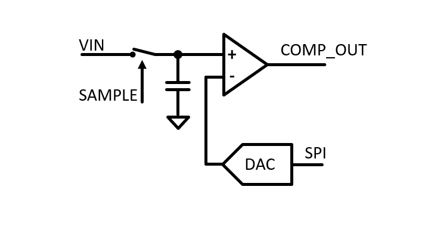

========================================
Experiment: Successive Approximation ADC
========================================

.. figure:: images/sar_adc.png
    :width: 300
    :align: center

    SAR ADC Module

In this module, function and performance of a 8-bit successive-approximation register analog-digital-converter (SAR-ADC) will be studied. A SAR-ADC main function blocks consists of a digital-to-analog converter (DAC), a sampling switch and capacitor, a comparator and some digital control logic. The diagram below shows the basic function blocks. The SAR logic which will be implemented as part of the user code on the Raspberry Pi will control the DAC via an SPI bus and interface to the two GPIO signals SAMPLE and COMP_OUT. 

    Functional block diagram of the SAR-ADC

Successive Approximation 
------------------------
A conversion begins with switching the input node from tracking the input voltage ("track mode") to storing its momentary value on the sampling capacitor ("hold mode"). In hold mode the input voltage to the comparator is kept constant during the conversion time of the SAR ADC. To find the binary representation of the stored voltage, its value is compared to the programmable output voltage of a digital-to-analog converter (DAC). In an iterative process the result of the comparison is used to define the next DAC output voltage. To minimize the number of necessary comparison cycles, the successive approximation method is used: Instead of linear increasing (or decreasing) the DAC output voltage and capturing the DAC register value at which the comparator output changes its state (this ADC type is called "Wilkinson" ADC), a SAR-ADC switches and compares the DAC voltage bit by bit starting from the most significant bit (MSB) down to the least significant bit (LSB). This method allows an n-Bit ADC to convert an analog value within n-cycles. The SAR sequence for a conversion which would be generated by the control logic looks like this (pseudo code):

.. code-block:: c

  1. // open the sample switch (hold mode)
  SAMPLE = 0

  2. // start with DAC mid-range voltage: set MSB to '1' by shifting a '1' n-bits to the left
  DAC_register = 1 << n          
  
  3. // Repeat code block below n-times while j runs from n-1 to 0.
  if (VDAC < VIN)            // compare ADC input with DAC output (i.e. read the result of the comparator)
    DAC_register -= (1 << j) // DAC output larger then VIN, subtract next LSB value from current DAC setting
  else
    DAC_register += (1 << j) // DAC output smaller then VIN, add next LSB value to current DAC setting
 
  4. // The final DAC register value after n-iterations is the digital representation of the analog input voltage.
  result = DAC_register

  5. // close the sample switch (track mode) to prepare the next conversion
  SAMPLE = 1
  
Digital to Analog Converter
---------------------------
The digital-to-analog converter is implemented with a resistive voltage divider and a reference voltage VREF. Programmable switches can set the output voltage in a range from 0 to VREF(2^(n-1))/(2^n) with a step size of VREF/(2^n). A resistive voltage divider for an n-bit DAC can be constructed from 2^n equal sized resistors and 2^n switches (also called a resistor string divider or thermometer encoded ladder) or a binary weighted ladder. The latter one would require only n+1 resistors with values from R to 2^n x R. However, the required matching of resistor values over that value range is typically not easy to achieve. A clever re-arrangement of resistor and switches using 2x n resistors and n switches allows the usage of resistors with the value R and 2x R only. This so-called R-2R ladder is used for the module's DAC.
 
 .. figure:: images/R2R_ladder.png
    :width: 500
    :align: center

    Resistive ladder (R-2R) digital analog converter
    
The voltage at the output of the ladder is VREF times the binary weighted sum of the DAC's register bits DAC_REG set to '1'.

.. math::
  
  V_{DAC} = DAC_{REG} \cdot \frac{V_{REF}}{2^n}.

 
Circuit Implementation 
----------------------
A simplified circuit diagram of the SAR-ADC is shown here. The R-2R ladder switch configuration is implemented with an 8-bit digital buffer whose power supply is connected to VREF = 4.096 V. That allows the data outputs to switch between 0 and 4.096 Volt. The control bits D[7:0] are shifted into the register via an SPI bus interface.
 
 .. figure:: images/SAR_ADC_circuit.png
    :width: 600
    :align: center

    Simplified circuit diagram

The full circuit schematic is found here: :download:`SAR_ADC_1.1.pdf <documents/SAR_ADC_1.1.pdf>`

ADC Characterisation
---------------------
An important performance parameter of an ADC is its linearity. An ideal n-bit ADC generates an binary output according to 

.. math::

  ADC_{code} = V_{IN} \cdot ADC_{GAIN} + ADC_{offset} 

with

.. math::

  ADC_{GAIN} =  \frac{2^n}{V_{REF}} \text{ and } ADC_{OFFSET} = 0.

That implies that all ADC codes are representing the same bin width of analog values (i.e. gain and offset are constant and do not depend on the input voltage). Testing this specification can be done by generating analog voltages over the full ADC input range and comparing the conversion result to the generated voltage. Since the accuracy of the generated voltage has to be much higher then the resolution of the ADC, this procedure can be quite challenging, in particular for high resolution ADCs. A more efficient approach is to generate an input signal which is not precisely controlled step-by-step but rather provides a know amplitude (or code) density spectrum. This statistical method, also called histogram method, will be used for the ADC characterisation.

Test Signal Generator 
--------------------
The ADC module provides a simple signal generator which generates a saw-tooth waveform output voltage. This linear ramp will generate a considerably flat amplitude density spectrum over most of the ADC's dynamic input range. This ramp signal will be used to characterise the ADC's linearity.

- Dynamic range, calibration
- Noise
- Linearity (INL/DNL)

Exercises 
---------

.. admonition:: Exercise 0. A bit of theory
  #. Show that the output voltage of an R-2R ladder is defined by the formula given above (derive the equation). Hint: Start with a 1-bit DAC and calculate its output impedance. Does it depend on the switch setting? What ar the two voltage levels the 1-b DAC can produce? Then, derive a formalism for an n-bit DAC.
  #. Make a plot of an non-ideal ADC transfer curve and explain the terms offset, gain, dynamic range, DNL, INL, missing bits
  #. Derive the formulas to calculate DNL and INL from a code density histogram.
  #. What is the differential non-linearity of an ideal ADC?

.. admonition:: Exercise 1. R-2R ladder DAC

  #. Write a script that allows the programming of the R-2R DAC via the SPI bus and measure the DAC output voltage for each bit (binary weights) with a DVM connected to the ``OUTPUT`` connector (set the output jumper to ``VDAC``). Compare the LEDs connected to the digital buffer's output with the binary value you send via the SPI bus.
  #. Calculate and plot the expected DAC transfer function based on the measured binary weights of the DAC. Plot the INL and DNL of the DAC.
  
.. admonition:: Exercise 2. SAR Logic

  #. Program a loop which produces a saw tooth pattern at the DAC output. Connect an oscilloscope to the ``OUTPUT`` connector. Explain what you see. What is the period of the waveform? How can you change it? 
  #. Add an control statement to the loop and adjust the code such that it will implement the SAR logic as described above. Use ``print`` statements to examine the DAC register setting during the loop. Alternatively, run the code in debug mode and inspect the variables in the debugger window.
  #. Connect a dc-voltage source (lab power supply) to the ``ADC_INPUT`` connector and test your SAR code. Note that the comparator needs some time to stablize its output after the DAC register has been changed (insert some delay between DAC update and comparator output read). Measure the sample rate either within the script (use for example Python **tqdm** module in the acquisition loop) or with the oscilloscope (measure the ``SAMPLE`` signal frequency). What is the maximum sample rate you can achieve? What is the dominant limit?

.. admonition:: Exercise 3. Dynamic range and calibration

  #. Sweep the lab power supply from 0 to 4.2 Volts in 200 mV steps and measure the voltage with a single acquisition of the SAR-ADC. Plot the ADC transfer curve. Repeat the measurement and compare the results from the two sweeps. 
  #. Make a third sweep using an average of 8 (16) for each data point and extract gain and offset of the ADC. Compare the results to the ideal ones.
  #. Use the gain and offset values in your script to convert the ADC code into Voltage units. What is the dynamic input range of the ADC (in Volts)?

.. admonition:: Exercise 4. Integrated- and Differential Nonlinearity

  #. Connect the output of the ramp generator (set the output jumper to ``RAMP``) to the ADC input. Extend the script that it records a programmable number of acquisitions (start with ~10 per ADC code -> ~2500 total) and plot the values in a histogram (bin size of one, ADC code units). What is the useful range of the ramp signal? Compare this measured range to the direct observation of the ramp with an oscilloscope.
  #. Record ADC data with higher statistic (~100 entries per ADC code) and plot the histogram within the useful dynamic range of the ramp waveform.
  #. Generate DNL amd INL plots from this histogram and calculate the RMS values. Evaluate the effect of the statistic on the reproducibility of the measurement. How much data points do you need to get "stable" results? 
  #. Change the above mentioned delay time between DAC register update and comparator read and repeat the INL/DNL analysis. What setting would you chose to optimize linearity? What sample rate does this yield? Plot sample rate vs. DNL for a reasonable range.

Keywords and literature references
----------------------------------
* ADC architectures
* R-2R resistor ladder
* ADC testing methods (histogram method)
* Integrated- and Differential Non-linearity
