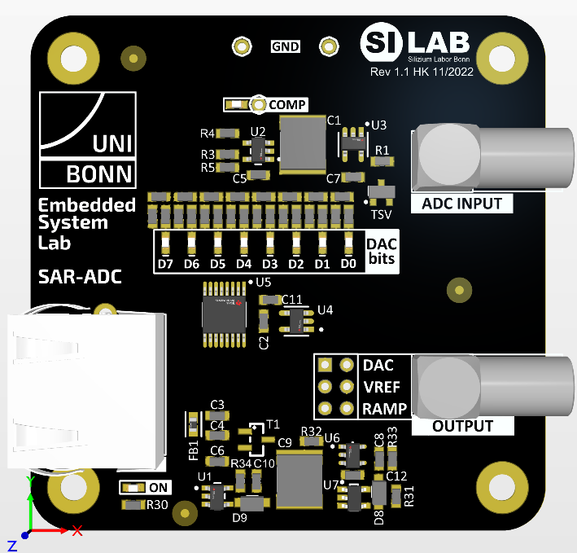

========================================
Experiment: Successive Approximation ADC
========================================

    SAR ADC Module

In this module, function and performance of a successive-approximation register analog-digital-converter (SAR-ADC) will be studied. A SAR-ADC consits mainly of a digital-to-analog converter (DAC) and a comparator.

.. figure:: images/sar_adc_block.png
    :width: 600
    :align: center

    Functional block diagram of the SAR-ADC

To find the digital equivalent of an analog value, the input voltage is compared to the programmable  output voltage of a DAC. To minimize the number of neccessary comparison cycles, the successive approximation method is used: Instead of lineary increasing (or dereasing) the DAC output voltage and capturing the DAC register value at which the comparator output changes its state (that ADC concept is called "Wilkinson" ADC), a SAR-ADC switches and compares the DAC voltage bit by bit starting from the most significant bit (MSB) down to the least significant bit (LSB). This method allows an n-Bit ADC to convert an analog value within n-cycles. The SAR sequence for a conversion looks like this (pseudo code):

.. code-block:: c

  1. // start with DAC mid-range voltage: set MSB to '1' by shifting a '1' n-bits to the left
  DAC_register = 1 << n          
  
  2. // Repeat code block below n-times while j runs from n-1 to 0.
  if (VDAC < VIN)            // compare ADC input with DAC output (i.e. read the result of the comparator)
    DAC_register -= (1 << j) // DAC output larger then VIN, subtract next LSB value from current DAC setting
  else
    DAC_register += (1 << j) // DAC output smaller then VIN, add next LSB value to current DAC setting
 
  3. // The final DAC register value after n-iterations is the digital representation of the analog input voltage.
  result = DAC_register
  
Digital to Analog Converter
---------------------------
 - R-2R Resistor DAC
Successive Approximation Logic
-----------------------------
ADC Characterization
---------------------
- Noise
- Linearity
- INL/DNL
