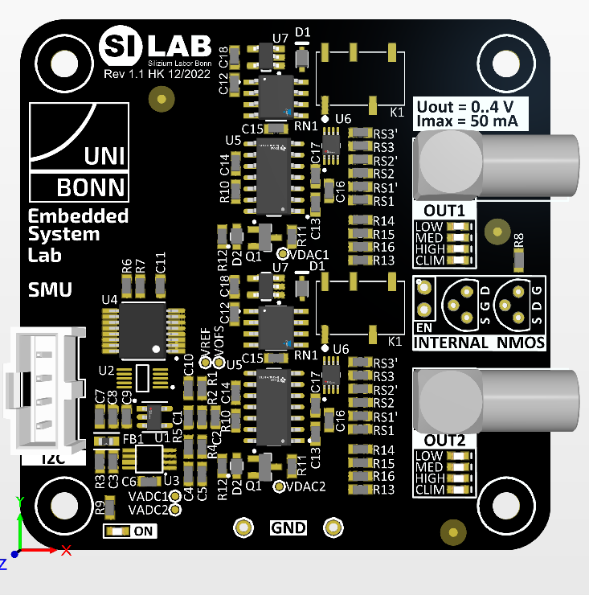

.. include:: replacements.rst
===================================
Experiment: MOSFET Parameter Extraction
===================================

    Source-Meter Module

In this experiment the characteristic I-V curves of (active) electronic devices will be measured and used for the extraction of devices electrical parameters. For example, a MOSFET is typically characterized by it threshold voltage |VTHR|, its transconductance |gm|, which describes its voltage-to-current gain and other parameters, which can be extracted from I-V measurements. The SMU ('source monitoring unit') module used in this experiment provides two programmable voltage sources with a wide range current sensing capability (~mA down to ~nA). The Raspberry Pi connects to the SMU via an I2C bus which writes the data to the on-board DAC which sets the output voltages and reads back the measured output current.

Source Monitoring Unit
=====================

The SMU module is a dual channel voltage source that supports single-quadrant measurements. That means it can only generate positive potentials and the measurement polarity is restricted to current flowing out of the module into the device. Four-quadrant SMUs, as typically available with commercial test equipment, can do bipolar current measurement independent of the polarity of the output voltage. Commercial SMUs can also be configured to work as a programmable current source while this module only provides the voltage source mode.

The SMU module has two independent channels which supply a programmable voltage in the range of 0 to ~4 Volts. The voltages are set by a 12-bit DAC which is written via an I2C bus from the Raspberry Pi board. With a reference voltage |VREF| = 4.096 V and 12-bit resolution the DAC LSB corresponds to 1 mV. Thus, the SMU output voltage is 

.. math::
  
  V_{OUT} = DAC_{REG} \cdot \frac{V_{REF}}{4096} =  DAC_{REG} \cdot mV.

The DAC output voltage is buffered by an opamp configured as a unit gain buffer. A sense resistor |RSNS| at the opamp output is used for the current measurement. The voltage drop across |RSNS| is amplified by a difference amplifier with a gain of 10 and then digitized by an 12-bit ADC which is also connected to the I2C bus. The figure below shows the simplified circuit diagram of one SMU channel.

 .. figure:: images/SMU_block.png
    :width: 600
    :align: center

    Simplified circuit diagram of a single SMU channel.

To improve the dynamic range of the current measurement, the sense resistor |RSNS| can be selected from three values (8 Ohm, 800 Ohm and 80 kOhm). The selection is controlled via a multiplexer which is also programmed over the I2C bus. The programmable sense resistor enables these current measurement ranges: 

===========  ========  ===========  ==================  ==========
 Range       SEL[1:0]  |RSNS|[Ohm]   Max. current [A]    I LSB [A]  
===========  ========  ===========  ==================  ==========
  Off          00        ---         Output is off         ---      
  LOW          01        80 k         5.12 µ             1.25 n      
  MID          10       800            512 µ               125 n      
  HIGH         11         8           51.2 m              12.5 µ      
===========  ========  ===========  ==================  ==========

The ADC input voltage |VISNS| which corresponds to the SMU output current is given by

.. math::
  
  V_{ISNS} = I_{OUT} \cdot R_{SNS} \cdot 10.

The 12-bit ADC converts this voltage according to

.. math::

  ADC_{CODE} = V_{ISNS} \cdot \frac{4096}{V_{REF}} = I_{OUT} \cdot R_{SNS} \cdot 10 \cdot mV^{-1},

and therefore

.. math::

  I_{OUT} = \frac{ADC_{CODE}}{R_{SNS} \cdot 10} \cdot mV.

This formula is the conversion factor (conversion gain) to calculate the output current in mA units from the ADC code. To use the full dynamic current measurement range, the switching between current ranges can be automated by the measurement scripts: During a voltage sweep, the measured current should be compared to threshold values defined by the boundaries between the current measurement ranges (5 µA and 500 µA) and the ranges selected accordingly.

There are a few more circuit details which are found in the full circuit schematic: :download:`SMU_1.1.pdf <documents/SMU_1.1.pdf>`. For example, the module has on-board sockets to connect a transistor to the SMU output channels without using the LEMO connectors. Other circuits elements are used to decrease the output resistance of the multiplexer in the highest current range and to limit the output current to the range maximum.

I-V Curve Measurements
======================

The simplest I-V curves are obtained by a measuring a device with two ports (a resistor or a diode, for example) which gets connected to one of the SMU outputs. The measurement script then sweeps the the output voltage of the used channel in a given range and step size. The smallest voltage step is 1 mV which corresponds to one DAC bit (see DAC output voltage calculation above). For faster voltage sweeps with less points, the voltage step size can be increased. In the scan loop, the output current is measured for each voltage step and both values are stored for later plotting and analysis. 

Devices with more than two ports like transistors typically have more than one voltage applied. For example the input characteristic of a MOSFET (drain current |ID| as a function of the gate voltage |VGS|) requires the drain and the gate potential to be individually controlled (i.e. |VGS| is swept while |VDS| is held constant). For those kind of I-V measurements, both SMU channels will be used simultaneously. 

MOSFET Parameter Extraction
===========================

A MOSFET is characterized with a number of electrical parameters describing its dc- and ac- performance. Many of these parameters are typically found in the devices datasheet and even more parameters are needed for simulation models. Special integrated test equipment dedicated for parameter extraction is typically used for this task. Simple I-V scans, however, can be used to extract some of the basic MOSFET parameters: 

 * Transconductance |gm| 
 * Threshold voltage |VTHR| 
 * Subthreshold slope
 * Output resistance |go|

The MOSFET input characteristic (|ID| vs |VGS| curve) is used to extract transconductance |gm|, threshold voltage |VTHR| and subthreshold slope, and the output characteristic (|ID| vs |VDS| curve, with |VGS| as a parameter) allows the extraction of the output resistance |go|.

 ....

Exercises 
---------
There is a script ``smu.py`` in the folder ``code\SMU`` which contains the necessary includes and the basic configuration for the I2C interface and the I2C devices (DAC, ADC and |RSNS|-MUX) on the SMU module. Copy it into your ``work`` folder and use it as a template for your scripts. There is also another file called ``smu_solution.py`` which contains working code for most of the exercises. Note that this should only be used for reference or as a last resort if you got stuck.

.. admonition:: Exercise 0. A bit of theory

  #. What do the terms "accuracy" and "precision" mean? Where is the difference? 
  #. Plot the theoretical current measurement error as a function of the current for a fixed current measurement range (no switching of |RSNS|). Assume that the error is only given by the ADC resolution (i.e. quantization noise). Repeat the plot considering automatic switching of the current measurement range. Also use a logarithmic y-scale for the plots.
  #. Plot the number of current measurement bins as a function of the connected resistance for each current range. Use the data from the table above and the output voltage range of 4.096 V and a step size of 1 mV. Hint: Only if the connected resistance is equivalent to the ratio of maximum output voltage (4.096 V) and maximum current for the given range, the number of bins reaches the theoretical maximum of 4096. If the resistance is higher, the number of bins is limited by the resolution of the current measurement (the maximum output voltage is reached before the maximum current value). If the resistance is lower, it is the other way around and the resolution of the voltage generation (DAC) sets the limit. The three plots below illustrate the situation. Shown are the I-V curves for the same three scaled resistors using the three current ranges. The resistance R ist best captured in the middle range while resolution for the the x50 (/50) resistance curves are limited by the ADC (DAC), respectively. Switching to lower (higher) current ranges for the higher (lower) resistance improves the resolution significantly .

  
  .. figure:: images/smu_ranges.png
    :width: 600
    :align: center

    I-V curves for three scaled resistors using the three available current ranges (current and voltage values in DAC/ADC code units).

  #. List and describe the operation regions of a MOSFET. What are the meanings of weak-, moderate- and strong inversion? What is the difference between linear- and saturation region?. Plot example I-V curves to explain.
  #. Derive the formula for definition of the transconductance |gm|. 
  #. What different methods exist to extract |VTHR| from I-V curves?

.. admonition:: Exercise 1. I-V scan loop implementation
  
  #. Write a simple script which allows to set the output voltage and read back the current of an SMU channel (you also need to set a current range, otherwise the output will be off). Control the output voltage with a DVM and compare the measured voltage with the value you have set in the script. Implement the current range selection and check the LED on the board for the selected range.
  #. Add a loop statement to the script and connect a 1 kOhm resistor to the output. Measure and plot I-V curves for all three current measurement ranges (fixed ranging).
  #. Extract the slope and offset from each of the three I-V curves. How good do the three current ranges match? 
  #. Connect a diode to the SMU and plot the I-V curve for the forward region of the diode. Make the scans for all three current ranges separately and combine the traces in one plot. Remember to set the calibration constant to convert ADC code to current according to the selected current range.

.. admonition:: Exercise 2. Automatic current range selection

  #. Implement an "autoranging" functionality in the scan loop. Measure the diode I-V curve again and plot linear and log current scales. 
  #. Now consider the precision of the current measurement. Repeat each current measurement 100 times and plot the standard deviation as error bars (choose a large voltage step size to limit the scan time). Compare the error to the theoretical limit given by the quantization error (see Exercise 0). What additional noise sources have to be considered?
  #. Improve the measurement precision by averaging over a number of current readings for each voltage step. Consider to adjust the number of averages according to the measurement range to optimize the scan time.
  #. Redo the diode I-V curve with the optimized scan loop and minimum voltage step size. Examine the curve at the points where the current range changes (also plot the derivative). How good do the |RSNS| resistor values match?

.. admonition:: Exercise 3. MOSFET Parameter Extraction

  .....